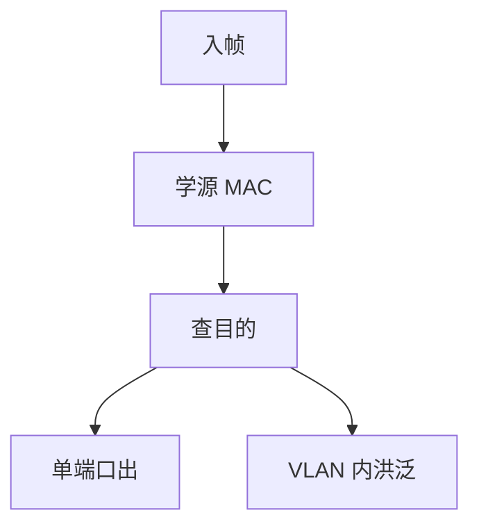
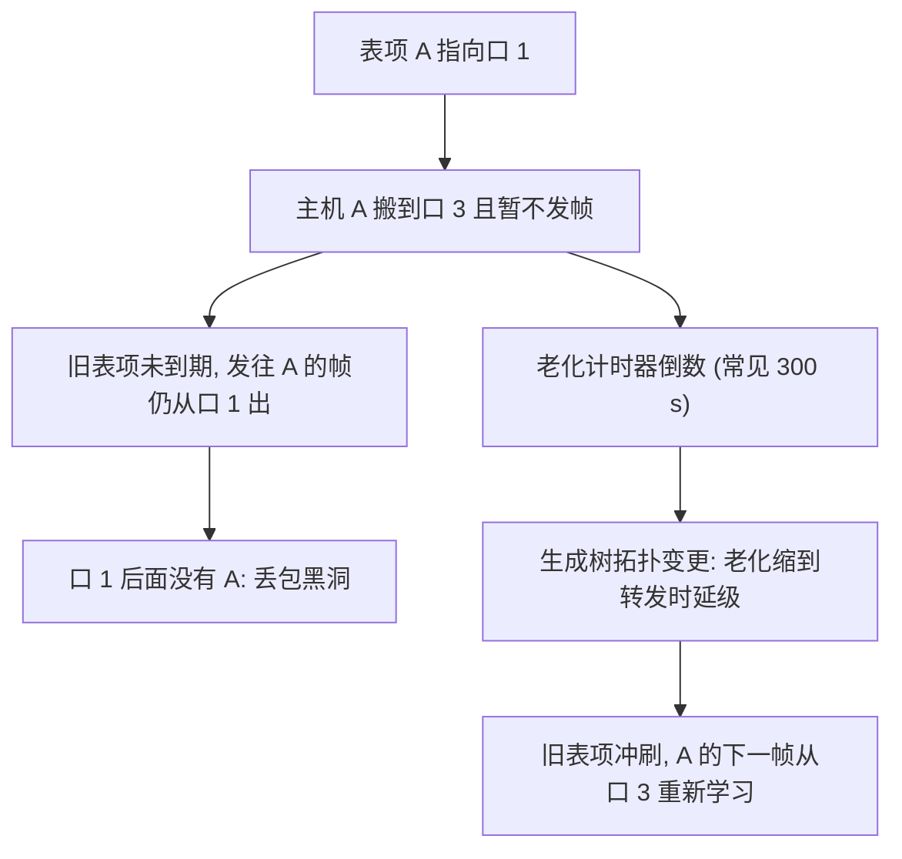

# MAC 学习与洪泛

源地址写入入端口的转发表，目的命中则单播，未知、广播、组播则洪泛；表会老化，环会让表振荡。

<footer>—— 据 Kurose and Ross 交换章；IEEE 802.1Q 转发表条款整理</footer>

[上一课](/cs/rstp-mstp)保证无环之后，洪泛才安全。主干[CSMA 与交换](/cs/csma-switch) 已给过学习直觉。缺口是**表项生命周期与洪泛集合**：老化、VLAN 隔离、未知单播行为、与 LACP 逻辑口。本课不把交换芯片背板写完。

## 问题

帧进来：学源 MAC → 查目的。命中且出口≠入口则转发；同口则过滤（到自己）。未命中：向该 VLAN 内除入口外的转发态口洪泛。老化（常见 300 s）防止主机搬家后黑洞。RSTP 拓扑变更缩短老化，否则帧仍从旧口出。

组播若无 IGMP 窥探（后课）当广播洪泛。这是二层默认，不是 bug。

表容量有限：溢出则更多未知洪泛，像回到集线器。CAM 耗尽攻击是安全课对象，本课只钉机制。

直觉类比：交换机像门卫记人脸——谁来过就记下「这张脸走哪个门」。收件人没登记过（未知单播）就把信挨个门喊一遍（洪泛），谁应答就记下谁。喊一圈是学习的代价，不是网络故障；喊过之后同一收件人就走单播了。

### 学源查宿

未知单播在 VLAN 内洪泛；表满则更像集线器。TCN 缩短老化，否则走旧口。ARP 表在主机，交换机只搬 MAC。

数字实例：老化时间常见 300 秒。若笔记本从口 1 挪到口 3 后保持沉默，旧表项最长还能「活」5 分钟，期间发往它的帧全从口 1 出、被丢——这正是拓扑变更要把老化缩到秒级的理由。

## 方法

画：学习、查找、洪泛、老化、TCN 冲刷。对照路由器：路由器不因源 IP 学出接口来转发（除某些特殊），交换机必须学。LACP：学在逻辑口上，哈希再选成员。

```mermaid
flowchart TD
  IN["入帧"] --> LRN["学源 MAC"]
  LRN --> LK["查目的"]
  LK --> HIT["单端口出"]
  LK --> FLOOD["VLAN 内洪泛"]
```

## 机制

巨帧、PAUSE 不改学习键：键是 MAC+VLAN。LLDP 源 MAC 也会被学到，除非控制帧另通道。生成树阻塞口不学习数据，仍可收 BPDU。

未知单播洪泛会把流量送到所有接入口：大二层数据中心的痛点，后课 VXLAN/EVPN 用控制面分发 MAC 来收敛洪泛。

```mermaid
flowchart TD
  T0["表项 A 指向口 1"] --> MOVE["主机 A 搬到口 3 且暂不发帧"]
  MOVE --> STALE["旧表项未到期, 发往 A 的帧仍从口 1 出"]
  STALE --> BLACK["口 1 后面没有 A: 丢包黑洞"]
  MOVE --> TIMER["老化计时器倒数 (常见 300 s)"]
  TIMER --> TCN["生成树拓扑变更: 老化缩到转发时延级"]
  TCN --> FLUSH["旧表项冲刷, A 的下一帧从口 3 重新学习"]
```

常见误区：初学者容易把洪泛等同于广播风暴。未知单播/广播洪泛每帧只喊一次，学习收敛后转单播；风暴来自物理环路让帧无限自我复制。所以次序是：生成树先拆环，洪泛才安全——环拆晚了，表还会随复制帧来回振荡。

## 边界

本课不引入 EVPN 路由类型。交换机架构与背板是下一课。后课默认：学习+老化+洪泛是二层转发的全部控制面（无路由协议）。

不要把 MAC 表当成 ARP 表：ARP 在主机把 IP 映到 MAC；交换机只搬 MAC。

下一课[交换机架构与背板](/cs/switch-fabric)。

## 小结

- 学源、查宿；未知则 VLAN 洪泛。
- 老化与 TCN 防止走旧口。
- 表满则洪泛增多。
- 后课只引用本课钉死的对象，不从该领域总问题重开。
- 出处：Kurose and Ross；IEEE 802.1Q。
