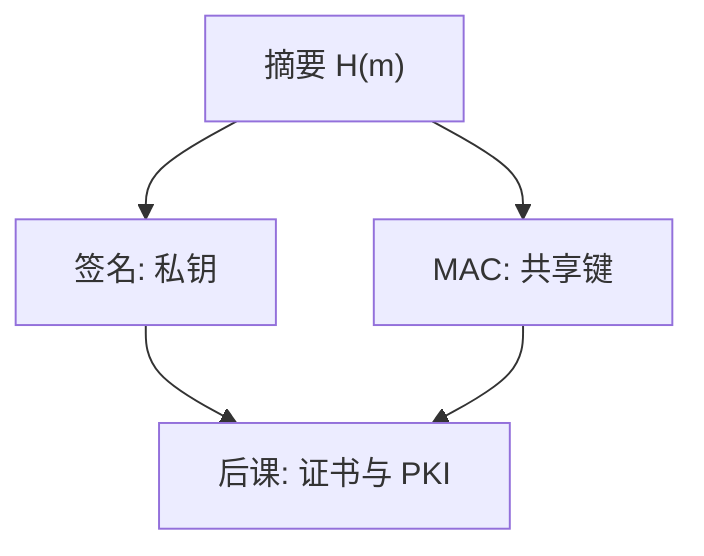

# MAC 与签名

MAC 证明「持有共享密钥的人认过这份字节」；签名证明「持有私钥的人认过」，且第三人可验。

<footer>—— 据 Goldwasser, Micali and Rivest 对签名方案；HMAC 作为 MAC 的工程标准整理</footer>

[上一课](/cs/hash-collision)给出抗碰撞哈希。本课不重证生日界。缺口是：完整与认证——谁能声称这段字节没被改、出自谁。共享密钥用 MAC；公钥侧用数字签名。两者都常先哈希再认证，但密钥用法与能否公开验证不同。

## 问题

AEAD 已能在对称会话里绑完整。许多场景要单独的认证标签，或要**不可否认**：验证方没有签名私钥，不能自己伪造，却能向第三方证明。缺口不是再讲加密，而是两条原语：MAC（对称、不可公开转述为「只有某一人能做」）、签名（私钥签、公钥验）。

裸 $H(k\|m)$ 有长度扩展等问题；HMAC 把密钥与哈希组合成标准 MAC。签名则对 $H(m)$ 做私钥运算，证书把公钥绑到名字。

## 方法

MAC：输入密钥与消息，输出标签；验证即重算比较（常数时间比较，避免泄长度以外的信息——侧信道课再收）。签名：Sign$(sk,m)$、Verify$(pk,\sigma,m)$。本课不选 RSA-PSS 还是 ECDSA 曲线，只锁定接口与失败含义：标签错或验签失败 ⇒ 不接受，至于是改包还是密钥错，协议层要另处理。

## 机制

MAC 服务 CIA 的 I 与真实性（在共享密钥团体内）。签名另加不可否认与公开验证，供证书链、软件更新、2PC 之外的「这个字节来自哪一身份」。密钥泄露模型不同：MAC 密钥泄露使双方都能伪造；签名私钥泄露使全世界都能冒充，直到撤销。

常数时间比较标签，避免把比较提前返回当成侧信道；细节在侧信道课。

## 边界

签名不是加密。加密的保密与签名的公开可验证可以组合（先签后封或相反），顺序有规范，本课不把每一种 CMS 变体写完。也不把「区块链签名」插入主干。时间戳、公证是额外服务。

MAC 不能转给第三方当证据：验证者自己也能造同一标签。这是不可否认缺席的精确定义。后课默认：完整性标签要么是 MAC/AEAD，要么是签名；名字如何绑到公钥，是 PKI。

验证失败应失败安全：不接受，不「尽量解密」。这与 Saltzer 的失败安全默认是同一句，对象换成标签。

## 小结
- 密钥泄露模型不同：MAC 团体内都能伪，签名私钥泄露则人人能冒充直到撤销。
- 后课证书把 $pk$ 绑到名字，否则签名只证明「某把私钥」。

- 哈希是零件；MAC 用共享键认证，签名可公开验证。
- 不可否认是签名相对 MAC 的差额，不是更长的摘要。
- 公钥如何被相信属于某个名字，是证书课缺口。
- 出处：Goldwasser, Micali and Rivest；RFC 2104 HMAC；Stallings。
