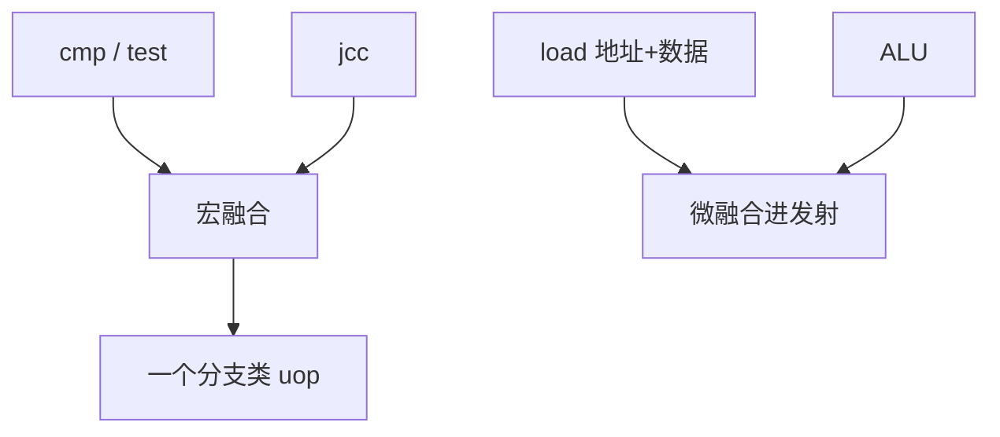

# 宏融合与微融合

比较加分支、访存加运算在 ISA 里是两条；若始终一起出现，译码可以把它们收成一个 uop 或一个发射槽，前端宽度立刻便宜一号。

<footer>—— 据 Intel 对 macro-fusion 与 micro-fusion 的公开描述；Hennessy and Patterson, CA:AQA 整理</footer>

[上一课](/cs/loop-stream-buffer)按 uop 计数决定循环能不能锁定。[取指带宽](/cs/fetch-decode-width) 的上限以「条」计。本课不重讲 LSB 检测。缺口是**融合：在译码把宏指令或微操作合并，使窗口与前端看到的条数变少**，而不改程序员看见的 ISA。

## 问题

x86 的 `cmp`/`test` 后面几乎总跟着 `jcc`：两条宏指令、两个 uop、两次重命名。地址生成与 load 也常跟 ALU 成对（`add rax, [rbx]`）。若硬件总是拆开，[发射队列](/cs/issue-queue-wakeup) 和 [PRF](/cs/prf-free-list) 都为这对「形影不离」的东西付双倍。缺口不是新预测器，而是**识别固定搭配，合成更少的内部操作**。

宏融合：两条宏指令 → 一个 uop（典型是 ALU+jcc）。微融合：一条宏指令内部的 store/load 地址与数据合成「一条」在部分流水段里占一个槽，到后端再裂开。

## 方法

译码器看相邻宏指令或一条宏指令的 uop 模板：符合白名单（如 `cmp`+条件跳、`mem`+ALU）则输出融合后的内部操作，RAT/IQ 只分配一次（或在指定级再裂）。核对与异常仍按架构的两条（或一条复杂指令）处理：调试器看见的 RIP 不能因为融合而跳错。

RISC-V 定长、正交，融合收益小；压缩指令已经在编码层减带宽。本课以 CISC 前端为主要动机，不把融合写成 RISC 必选项。

## 机制

有效 $D$ 上升：同样的取指字节产生更少 IQ 项，LSB 更容易装下循环。ROB 计数有的实现按 uop、有的按宏指令，影响「融合是否占用两个提交槽」——精确异常要以架构指令为界，不能把 `jcc` 的异常算到 `cmp` 上。

与预测：融合后的 uop 仍是一条分支，gshare/TAGE 的 PC 通常用跳转的 IP。

## 边界

本课不把宏融合白名单写成可移植 ABI。也不引入 VLIW 的编译器打包——那是后课 EPIC，软件可见。融合失败（中间夹杂别的指令、64 位某些模式限制）则退回两条。

后课默认：前端条数可以少于 ISA 条数。这些 uop 最终仍要按序提交，异常与中断看见的是架构状态，下一课退休。

## 小结

- 宏融合减宏指令条数，微融合减部分流水的槽占用。
- 精确性仍按 ISA 指令边界，不以融合后的内部形态为准。
- 提交与精确异常是下一课退休。
- 出处：Intel 软件开发者手册 / 优化手册；Hennessy and Patterson, *CA:AQA*。
