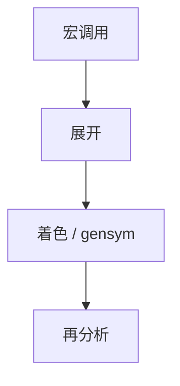

# 宏与卫生

宏是编译期的树或记号改写。不卫生的展开会捕获用户的名字；卫生宏用颜色或换名保证绑定结构不被偷偷改写。

<footer>—— 据 Kohlbecker, Friedman, Felleisen and Duba, Hygienic Macro Expansion, 1986；Clinger and Rees, Macros That Work, 1991 整理</footer>

上一课[语法制导翻译](/cs/syntax-directed-translation)假定记号流已是语言本身。缺口是**用户可定义的改写**：Scheme 的 `syntax-rules`、Rust 的 `macro_rules`、模板元编程的边缘。本课钉捕获与卫生，不把 C 预处理器的全部坑写完——那是下一课。也不重写 λ 的 α 换名，只引用：[λ 演算](/cs/lambda-calculus)里捕获会绑错，宏展开是同一事故的编译期版。

## 问题

非卫生：宏体里的 `tmp` 若与调用处的 `tmp` 同名，展开后绑到用户变量。卫生：宏引入的绑定带「颜色」，与用户标识符即使字符串相同也不冲突；用户传入的表达式在展开后仍绑到用户的环境。缺口是**展开算法的换名不变量**，不是再讲 SDT 的 `emit`。

对比函数：函数调用有求值规则与作用域；宏先改写再分析。把宏当函数会漏掉二次扫描与卫生。

### 卫生不是「不能写坏宏」

卫生防捕获；不防宏发出类型错误或指数大的代码。也不是卫生就不能故意 `unhygienic` 插入——部分语言提供逃逸，须显式。

Kohlbecker et al. 1986；Clinger–Rees 1991。Dybvig 的语法对象是工程标准参考。本课不进 typed template Haskell 的论文细节。

## 方法

记号宏：替换列表，几乎必不卫生（C）。卫生宏：解析成语法对象，带词法上下文，展开时 `gensym` 或着色。模式匹配宏（`syntax-rules`）默认卫生；过程宏（`syntax-case`）要人遵守 API。

与增量解析：宏展开使「源区间」映射变复杂，错误信息要指向调用处而非只指向展开后。接[错误恢复](/cs/parse-error-recovery) 的诊断契约。

## 机制

多次展开直到没有宏调用（或达上限）。递归宏须终止；语言用进度检查或深度帽。卫生保证的是绑定结构，不保证与手工 α 换名后的项在类型上一律等价——那要另外的宏类型系统，本课点名。

不要用宏模拟模块系统的全部封装；卫生不是隐私。

## 边界

本课不写 C 的 `#define` 扫描器。后课默认：卫生宏 = 展开不捕获；记号粘贴是另一家族。下一课 C 预处理器：故意不卫生、在词法阶段工作。

也不把 Rust 过程宏的编译器插件安全模型写完。

## 小结

- 宏是改写；捕获是 α 事故。
- 卫生用颜色或换名保住绑定。
- 记号宏（C）默认不卫生。
- 出处：Kohlbecker et al., 1986；Clinger and Rees, 1991。
