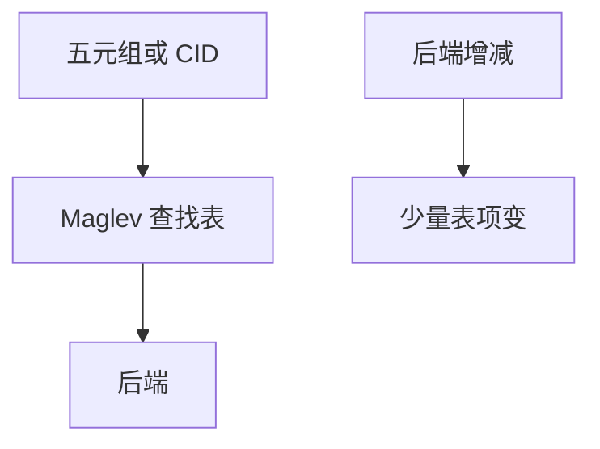

# Maglev

用一致性哈希表把五元组映到后端，后端增减时尽量少打断已有连接；查找是一次内存访问量级。

<footer>—— 据 Eisenbud et al., Maglev, NSDI 2016 整理</footer>

[上一课](/cs/l4-l7-load-balancing) 要选后端。[ECMP](/cs/ecmp-hashing) 哈希会在成员变化时大迁移。缺口是 **Maglev 一致性哈希**：查找表、后端故障。本课不把反向代理写完。

## 问题

ECMP 成员 down 几乎重哈希所有流。Maglev：为每个后端生成置换，填一张大表，查哈希(五元组) mod 表长。增减后端只扰动部分表项，连接尽量留。与 QUIC CID：可用 CID 当键，迁移后仍粘同一后端。L7 仍可在 Maglev 后再做。

不要把论文当唯一实现；思想是稳定哈希。

NSDI 2016。Google 生产。本课不抄表填充伪代码考试。

### 稳定哈希减扰动

成员变化只动部分连接。键可以是 CID。无健康检查会稳定打到尸体。极化仍可能。

## 方法

对照：取模哈希 / 一致性哈希 / Maglev 表。画：键 → 表项 → 后端。与 Kademlia DHT 的一致性哈希同族，一层 LB，一层 P2P。

方法止于选定对象与对照；机制才说它如何嵌入已有分层与主干课。

## 机制

健康检查更新表，与 BGP 撤回同类：控制面变，数据面查新表。极化仍可能。数据中心 Clos 上 Maglev 常在入口。RPKI 无。

失败：表未及时更新会打到死后端，要探测。

## 边界

本课不引入 Ketama 的全部变体。反向代理是下一课。后课默认：Maglev 式表提供稳定 L4 映射。

无健康检查的一致性哈希会稳定地打到尸体。

上一课留下的缺口在本课收口；「Maglev」进入后课词汇表后只引用。文献用来钉对象与边界，不把本课写成该主题的独立综述。下一课[反向代理](/cs/reverse-proxy)。

## 小结

- 一致性哈希减少成员变化时的扰动。
- 表查找线速。
- 键可从五元组扩展到 CID。
- 后课只引用本课钉死的对象，不从该领域总问题重开。
- 出处：Eisenbud et al., NSDI 2016。
