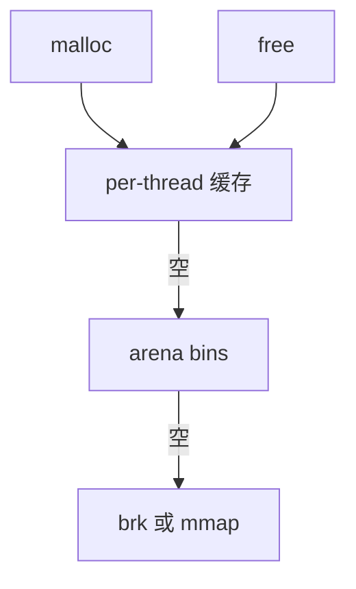

# malloc 实现

malloc 在用户态把 mmap/brk 来的页切成块：空闲链表或分大小的 bin，释放合并，再不够才向内核要。

<footer>—— 据 Wilson et al. 对动态存储分配的综述；ptmalloc/glibc 文档；McKusick 对用户堆的背景</footer>

[MTE](/cs/memory-tagging) 假定分配器配合。[buddy](/cs/buddy-allocator) 是内核页。[memcg](/cs/memcg) 看的是页。缺口是 **进程堆**：glibc malloc 一类，如何少 brk、如何对多线程。

## 问题

每次 `mmap` 4K 太粗、系统调用太贵。分配器：按 size class 把块串起来，大块单独 mmap。缺口：碎片（内外）、brk 收缩、与 fork 后锁（atfork）；double-free 检测是调试器，不是 POSIX。本课不把每个 bin 的阈值背下来。

`malloc_trim` 把顶空闲还内核。对齐与 `posix_memalign` 服务 SIMD/DMA 用户缓冲。

## 方法

小分配：从 tcache/fastbin 弹。耗尽：从 arena 的 bin 切，或 `mmap`。free：进 tcache，满则合并进 unsorted。对照 [slab](/cs/slab-allocator)：内核按对象类型；malloc 按字节大小。对照 [tmpfs](/cs/tmpfs)：堆是匿名页，不是文件。对照 [O_DIRECT](/cs/direct-io)：对齐缓冲常来自 memalign。

## 机制

用户分配器把内核页变成任意字节对象，是几乎所有应用的底座。错误的分配器造成锁争用或碎片，看起来像泄漏。不要写成量化风控额度。与 KSM：堆页内容相同才可能被合，通常不合。

安全：未初始化、UAF 是分配器与类型系统共同的问题；MTE/ASan 在此挂钩。

实现上：tcache 使 free 的块不立刻合并，RSS 不下降是预期。fork 后子进程继承 arena 锁状态，不用 atfork 会死锁。可调试分配器把红区放进真实 malloc，和 ASan 叠要小心。 读法上只引用[上一课](/cs/memory-tagging)的结论，不把对象换成训练推理或限价簿。

本课在操作系统进阶的「内存进阶 / 回收、迁移与加固」课序里，对象是 **malloc 实现**。

- 先修只引用，不重导：上一课的结论当公理，本课只补差。
- 五栏不吞并：不把本课写成大模型训练/推理，也不写成限价簿或权重量化。
- 文献用 OSTEP、McKusick、内核文档与具名会议论文；不发明 arXiv 编号。

## 边界

本课不引入垃圾回收语言运行时——那是语言课。不保证嵌入式无 mmap 的 sbrk 独苗。下一课多线程竞技场：jemalloc/tcmalloc。

版本字段会变，课序钉的是机制对象「malloc 实现」，不是某一主线内核的结构体名。
后课默认：进程堆由用户分配器切页。多 arena 减少锁，下一课。

## 小结

- malloc 用 bin 与可选 tcache 切内核页。
- 大块常独立 mmap；小块合并还 brk。
- 竞技场分配器是下一课。
- 出处：Wilson 综述；glibc malloc；*OSTEP* 用户内存。
