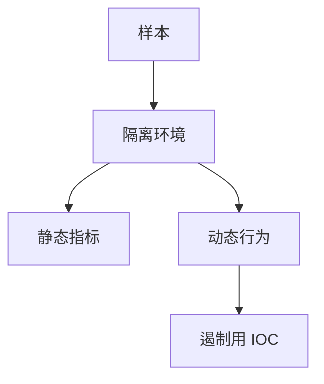

# 恶意软件分析

样本是带敌意的程序。分析要在隔离环境里回答：持久化点、通信、破坏范围。目标是特征与遏制，不是学习如何写一款。

<footer>—— 据 Sikorski and Honig, *Practical Malware Analysis*；对照 NIST 对恶意软件事故的处理</footer>

## 定位

上一课[逆向](/cs/reverse-engineering)给了读二进制的方法。缺口是**敌意样本的流程**：静态指标、动态沙箱、网络 IOC。本课不提供恶意软件编写或传播指导。

后课默认已经读完本课钉下的合同，只补差，不从该领域第一性原理重开。

## 问题

补丁课处理漏洞；本课处理已在跑的敌意代码。静态：字符串、导入表；动态：隔离虚拟机。缺口是安全分析环境，避免分析员机器成为扩散点。

### 法律与隔离

样本保管链、禁止外带。课程只讨论防御分析。

Sikorski and Honig。本课禁止制作或传播恶意软件。

## 方法

分静态/动态/网络。产出：哈希、C2 域名（情报）、持久化位置（IR 后课）。下一课 rootkit：更靠近内核的隐藏。

图中节点是本课的机制骨架；课程不把图展开成可运行的攻击步骤。

## 机制

发现与工程单元进入对抗代码。rootkit 下一课把隐藏放进内核或引导。

前提写进合同之后，游戏外的误用只当失败模式点名，不在本课写成操作程序。

## 边界

本课无制作教程。rootkit 下一课同样只讲检测与信任根。

## 小结

- 逆向用于理解；恶意软件分析用于遏制。
- 必须隔离；产出 IOC 与持久化点。
- 不教编写恶意软件。
- 下一课 rootkit。
- 出处：Sikorski and Honig；NIST 事故处理；Anderson。
