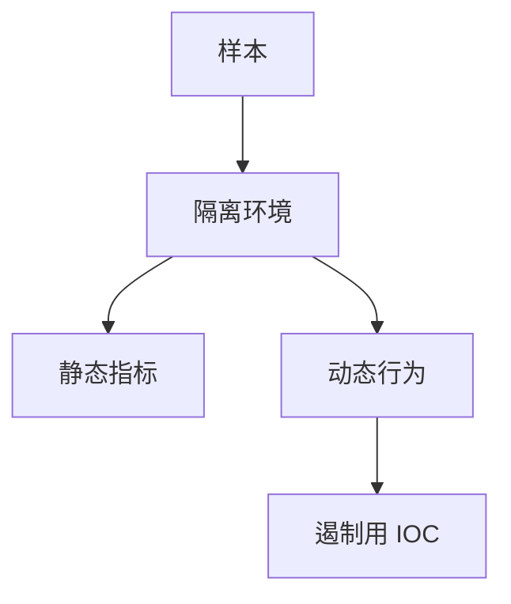
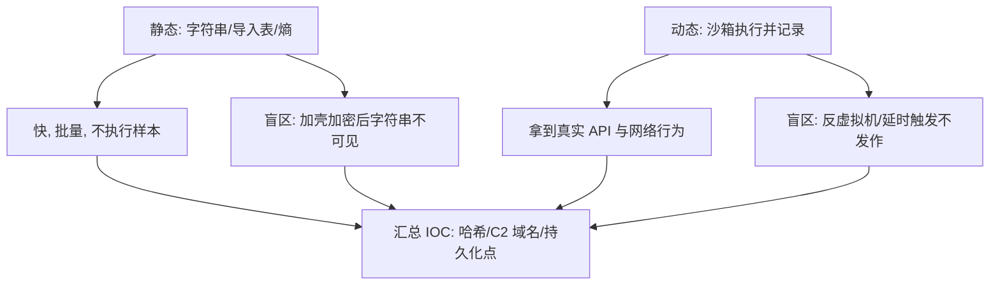

# 恶意软件分析

样本是带敌意的程序。分析要在隔离环境里回答：持久化点、通信、破坏范围。目标是特征与遏制，不是学习如何写一款。

<footer>—— 据 Sikorski and Honig, *Practical Malware Analysis*；对照 NIST 对恶意软件事故的处理</footer>

上一课[逆向](/cs/reverse-engineering)给了读二进制的方法。缺口是**敌意样本的流程**：静态指标、动态沙箱、网络 IOC。本课不提供恶意软件编写或传播指导。

后课默认已经读完本课钉下的合同，只补差，不从该领域第一性原理重开。

## 问题

补丁课处理漏洞；本课处理已在跑的敌意代码。静态：字符串、导入表；动态：隔离虚拟机。缺口是安全分析环境，避免分析员机器成为扩散点。

术语翻译：IOC（失陷指标）就是「中过招的痕迹清单」——样本哈希、C2 域名、开机自启项等。用途是拿去各处比对「谁家也有这些痕迹」，从而圈出破坏范围并加入拦截。

### 法律与隔离

样本保管链、禁止外带。课程只讨论防御分析。

为什么重要：分析用虚拟机必须「只进不出」——断真实网络、快照可回滚、共享文件夹关闭。样本一旦从分析环境逃进办公网，分析员自己就成了下一个传播节点；隔离失败比「没分析出结论」严重得多。

Sikorski and Honig。本课禁止制作或传播恶意软件。

## 方法

分静态/动态/网络。产出：哈希、C2 域名（情报）、持久化位置（IR 后课）。下一课 rootkit：更靠近内核的隐藏。

```mermaid
flowchart TD
  SMP["样本"] --> ISO["隔离环境"]
  ISO --> STAT["静态指标"]
  ISO --> DYN["动态行为"]
  DYN --> IOC["遏制用 IOC"]
```

## 机制

发现与工程单元进入对抗代码。rootkit 下一课把隐藏放进内核或引导。

```mermaid
flowchart TD
  S["静态: 字符串/导入表/熵"] --> SP["快, 批量, 不执行样本"]
  S --> SM["盲区: 加壳加密后字符串不可见"]
  D["动态: 沙箱执行并记录"] --> DP["拿到真实 API 与网络行为"]
  D --> DM["盲区: 反虚拟机/延时触发不发作"]
  SP --> IOC["汇总 IOC: 哈希/C2 域名/持久化点"]
  SM --> IOC
  DP --> IOC
  DM --> IOC
```

常见误区：初学者容易以为「沙箱里跑一遍就什么都知道」。动态只记录恰好被触发的行为：定时器没到、探测到虚拟机就装死，沙箱里一片祥和。所以静态与动态要互相印证——字符串看不见就先处理壳，行为不发作就换触发条件，两边的盲区才补得齐。

## 边界

本课无制作教程。rootkit 下一课同样只讲检测与信任根。

## 小结

- 逆向用于理解；恶意软件分析用于遏制。
- 必须隔离；产出 IOC 与持久化点。
- 不教编写恶意软件。
- 下一课 rootkit。
- 出处：Sikorski and Honig；NIST 事故处理；Anderson。
