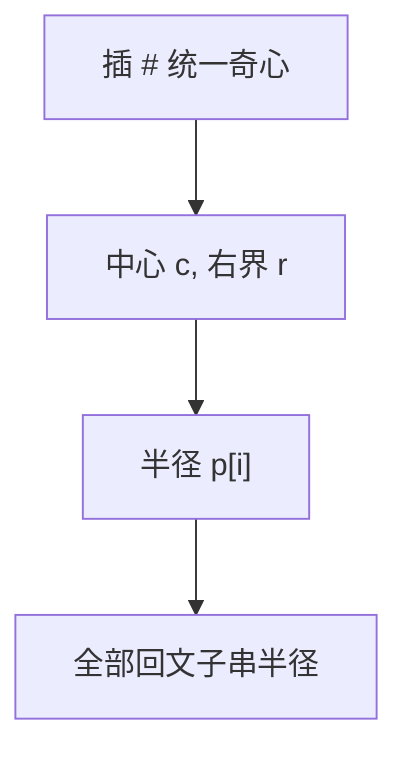

# Manacher

回文半径数组在已覆盖的对称窗口内复制，再尝试延长，线性求出全部最长回文半径。

<footer>—— 据 Manacher, A New Linear-Time On-Line Algorithm for Finding the Longest Palindromic Substring, 1975 整理</footer>

上一课[Z 函数](/cs/z-function)用 LCP 窗口。回文是中心对称，不是与前缀 LCP。缺口是 Manacher：奇偶中心用插入分隔符统一，半径 $p[i]$，$i$ 落在中心 $c$ 的窗口内则对称点有下界。不重写 Z-box 定义。后课最小表示法。

## 问题

最长回文子串朴素 $O(n^2)$ 扩中心。Manacher：串 `^#a#b#...#$` 使全奇。维护最右 $r$ 与中心 $c$。$i\le r$ 时 $p[i]\ge\min(p[2c-i], r-i)$，再扩。$r$ 单调，$O(n)$。

缺口是对称复制，不是哈希判回文（期望线性）。

### 子串不是子序列

回文子序列是另一 DP。本课连续子串。不要用 LCS 与反串当本课主算法——那是 $O(n^2)$。

Manacher 1975。后课最小表示是旋转，不是回文。回文树（eertree）点名。

## 方法

变换串。扫 $i$，按盒更新 $p[i]$，尝试扩，更新 $c,r$。原串下标换算。最长取 $\max p$。

计数不同回文子串要再处理。

## 机制

回文关于 $c$ 对称，窗口内的半径被对称点限制，超出部分才比较字符。与 Z：都是窗口均摊。与 KMP 无直接公式。

## 边界

本课不写回文树。不写二维回文。后课默认：最长回文子串线性 Manacher。下一课循环串最小表示。

## 小结

- 半径数组 + 对称窗口 = $O(n)$。
- 连续回文子串，不是子序列。
- 分隔符统一奇偶中心。
- 出处：Manacher, 1975。
