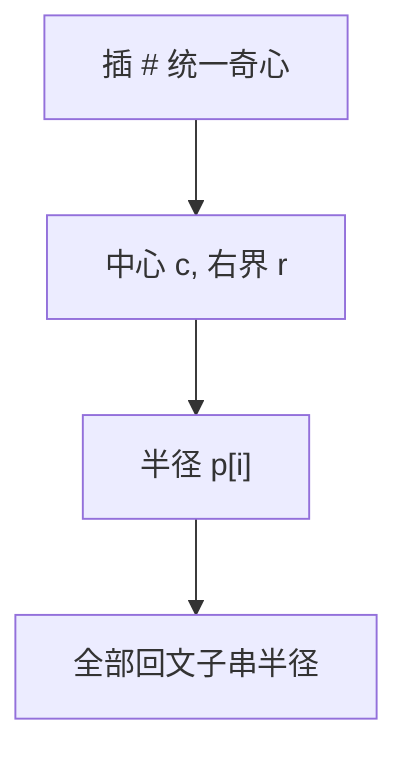
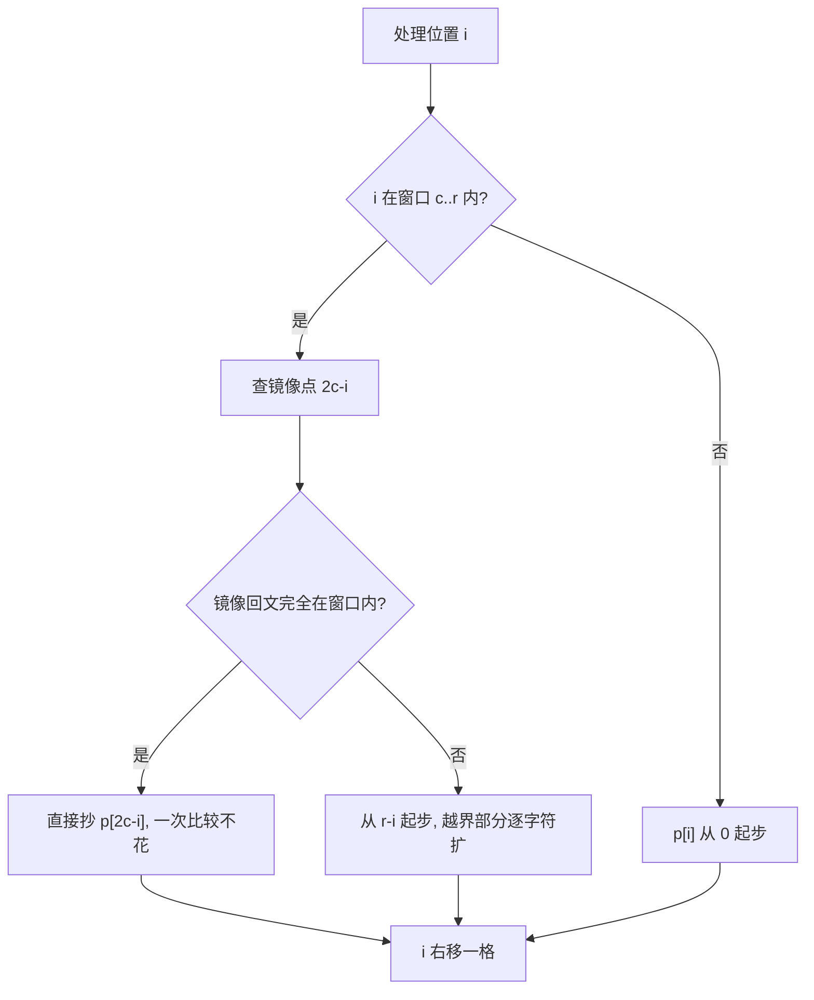

# Manacher

回文半径数组在已覆盖的对称窗口内复制，再尝试延长，线性求出全部最长回文半径。

<footer>—— 据 Manacher, A New Linear-Time On-Line Algorithm for Finding the Longest Palindromic Substring, 1975 整理</footer>

上一课[Z 函数](/cs/z-function)复用与前缀的 LCP 窗口；回文不同，它的约束是中心对称，不是与前缀比。缺口是 Manacher：怎么把已算出的回文在窗口内复用，把朴素扩中心的 $O(n^2)$ 压成 $O(n)$。不重写 Z-box 定义；后课最小表示法换回旋转串。

## 问题

朴素做法枚举约 $2n$ 个中心、逐个向外扩，最坏 $O(n^2)$。Manacher 第一步统一奇偶：字符间插 `#`、两端加哨兵，变换串（如 `^#a#b#...#$`）长 $2n+1$，回文半径全在字符位上定义，奇偶只剩一种。对每个位置记 $p[i]$：以 $i$ 为中心的最大回文半径。算法维护右伸最远的回文窗口（中心 $c$、右界 $r$）：当 $i\le r$ 时，对称点 $2c-i$ 已算过，其回文与 $i$ 的回文在窗口内逐位相同，故 $p[i]$ 从 $\min(p[2c-i], r-i)$ 起步，超出窗口的部分再逐字符比较。

数字实例：`ababa` 变换为 `^#a#b#a#b#a#$`，以中间那个 `a` 为中心的半径算出来是 5，恰好等于原串最长回文 `ababa` 的长度——分隔符让「变换串半径」与「原串回文长度」一一对应，奇偶两种中心合并成一种。

缺口是对称复制，不是哈希判回文（期望线性）。

### 子串不是子序列

本课对象是连续子串；回文子序列是另一套区间 DP。也不要拿「原串与反串的 LCS」当主算法——那同样 $O(n^2)$，Manacher 是确定性的线性。

 Manacher 1975。后课最小表示是旋转，不是回文。回文树（eertree）点名。 

## 方法

流程：先变换串；从左到右扫 $i$，落在窗口内先取对称点给的下界，再向两边尝试扩，扩成功就更新 $c,r$，窗口始终保持最靠右。结束取 $\max p[i]$ 为最长回文长度，原串起点是 $(i-p[i])/2$——分隔符使下标换算多一步，忘掉换算是最常见的错法。

```mermaid
flowchart TD
  S["插 # 统一奇心"] --> C["中心 c, 右界 r"]
  C --> P["半径 p[i]"]
  P --> PAL["全部回文子串半径"]
```

不同回文子串的计数不能拿 $p$ 直接求和（要区分来自原串字符与分隔符的回文），在本课结论上再处理，本课只点名。

常见误区：初学者最容易栽在换算上——$p[i]$ 是变换串里的半径，输出却要原串下标：长度直接取 $p[i]$，起点要按分隔符偏移折半。建议拿奇数长 `ababa` 与偶数长 `abba` 各测一遍，两种中心都对上才敢交。

## 机制

正确性系于一条对称性：大回文关于 $c$ 镜像，窗口内的 $i$ 与镜像点 $2c-i$ 的回文逐位相同。镜像回文完全落在窗口内时，$p[i]$ 直接抄 $p[2c-i]$，一次比较都不花；镜像回文顶到窗口右界时，只能保证 $r-i$，再往外必须逐字符验证——窗口外没有对称信息可抄。均摊记账：每次比较成功都让 $r$ 前进，$r$ 至多走 $O(n)$ 步，失败比较随即并入 $p[i]$ 终止，总时间线性。与 Z 函数同构的正是这套「窗口内复用、越界才扩」的记账；KMP 的失败指针是另一套结构，无直接公式。

```mermaid
flowchart TD
  I["处理位置 i"] --> IN{"i 在窗口 c..r 内?"}
  IN -->|"否"| ZERO["p[i] 从 0 起步"]
  IN -->|"是"| MIR["查镜像点 2c-i"]
  MIR --> CASE{"镜像回文完全在窗口内?"}
  CASE -->|"是"| COPY["直接抄 p[2c-i], 一次比较不花"]
  CASE -->|"否"| MIN["从 r-i 起步, 越界部分逐字符扩"]
  COPY --> ADV["i 右移一格"]
  MIN --> ADV
  ZERO --> ADV
```

直觉类比：右界 $r$ 像铺地板铺到的最远处，每次成功的比较都多铺一块；镜像点给的则是「看过的图纸」，窗内照抄、不必重铺。铺设总量封顶 $n$，所以整体线性——这就是均摊：个别位置多花几下，总账有人兜底。

## 边界

本课不写回文树（eertree），不写二维回文。后课默认：最长回文子串用线性 Manacher。下一课循环串最小表示。

## 小结

- 半径数组 + 对称窗口 = $O(n)$。
- 连续回文子串，不是子序列。
- 分隔符统一奇偶中心。
- 出处：Manacher, 1975。
