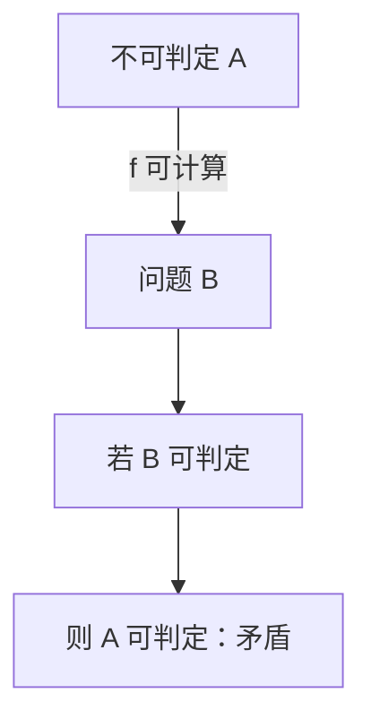

# 映射归约与不可判定

可计算函数 $f$ 满足 $x\in A\iff f(x)\in B$，则 $B$ 可判定会带走 $A$；不可判定沿箭头向上游走。

<footer>—— 据 Post；Sipser 整理</footer>

上一课[对角化与停机](/cs/halting-diagonalization)钉了 $A_{\mathrm{TM}}$ 与 $HALT$。缺口是传递：不必每次对角化。映射归约（many-one，$A\le_m B$）是可计算性里的 Karp 箭头。主干[多项式归约](/cs/np-reduction)已经练过方向；这里**没有多项式限制**，只要 $f$ 可计算。

## 问题

构造 $f$：实例变成实例，$x\in A\iff f(x)\in B$。若 $B$ 可判定，则 $A$ 可判定（先算 $f$ 再跑 $B$ 的判定器）。逆否： $A$ 不可判定 $\Rightarrow$ $B$ 不可判定。RE 同样： $B$ 可识别 $\Rightarrow$ $A$ 可识别。方向与复杂度课相同，资源不同。

例：空性 $E_{\mathrm{TM}}=\{\langle M\rangle\mid L(M)=\emptyset\}$。从 $A_{\mathrm{TM}}$ 化来：给定 $\langle M,w\rangle$，造 $M'$ 忽略输入、模拟 $M$ 于 $w$，接受则接受。$M$ 接受 $w$ iff $L(M')\ne\emptyset$。于是 $A_{\mathrm{TM}}\le_m \overline{E_{\mathrm{TM}}}$，$E_{\mathrm{TM}}$ 不可判定。

### 映射归约不是 Turing 归约

Turing 归约允许问神谕多次。映射归约是一次、非自适应、保持「是/否」双向。更强的归约会把更多集合连起来；课堂不可判定清单用 $\le_m$ 足够。

Post 问题关心 RE 度。Sipser 用 $\le_m$ 贯穿第 5 章。本课不引入度论。与 Karp $\le_p$ 对照：同一箭头形状，函数类从多项式换成可计算。

## 方法

证明 $B$ 不可判定：从已知不可判定的 $A$ 造 $f$。写清 $M'$ 做什么、为何可计算、为何当且仅当。常见模板：让 $M'$ 在「想要的语义」上模拟 $M(w)$，否则什么都不接受。

补：若 $A\le_m B$ 则 $\overline A\le_m\overline B$。故 $E_{\mathrm{TM}}$ 的补可识别与否要另说——实际上 $E_{\mathrm{TM}}$ 不是 RE。点名即可。

## 机制

有了归约，不可判定对象批量生产：$EQ_{\mathrm{TM}}$、是否有限、是否正则……下一课 Rice 一次打完「非平凡语义」。本课先掌握单次构造，避免 Rice 变成口号。

编码 $\langle M\rangle$ 必须是可计算的标准编码；细节不影响存在性。

构造 $M'$ 时要保证：无论 $M'$ 的输入是什么（常忽略），其语言只取决于 $M$ 在 $w$ 上的行为。漏掉「忽略输入」会让归约随 $M'$ 的输入变，当且仅当失败。RE 归约保持可识别；要证「不是 RE」，常化到 $E_{\mathrm{TM}}$ 或补 $A_{\mathrm{TM}}$。方向与[多项式归约](/cs/np-reduction)相同，只是 $f$ 不必多项式。

## 边界

本课不证 Rice，不引入算术层级的完整归约。不把 $\le_p$ 的 NPC 证明搬过来——那是复杂性单元。后课默认：传递不可判定用 $\le_m$，箭头方向与[多项式归约](/cs/np-reduction)相同。下一课语义性质。

归约函数必须对所有实例可计算且总停：用停机问题当 $f$ 的内部会把归约写废。箭头画反则证到了错误的那一侧。Rice 下一课把模板批量应用。

## 小结

- $A\le_m B$：可计算 $f$ 保持成员；难度向上游。
- 从 $A_{\mathrm{TM}}$ 构造 $M'$ 是标准手法。
- 无时间限制；不是 Karp 归约的复述，但方向相同。
- 出处：Post；Sipser。
