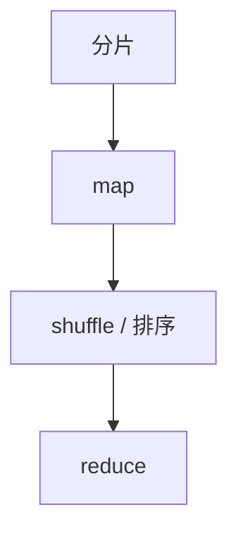

# MapReduce

把批处理收成 map 与 reduce 两次用户函数，中间用按键分区的排序连接；容错靠再执行任务，不靠分布式共享内存。

<footer>—— Dean and Ghemawat, MapReduce, OSDI 2004 / CACM 2008</footer>

[上一课](/cs/lakehouse-table-format)给出可共享的表快照。缺口是**如何在上千台机器上算**：不是新 SQL，是把函数接到分区洗牌。本课钉 MapReduce；Spark DAG 下一课去掉强制的两阶段。

## 问题

全表扫描 + 分组聚合：map 发射 `(k,v)`，shuffle 按 `k` 聚集，reduce 做合计。缺口是调度与容错：一台 map 挂了，只重跑该分片；reduce 读的是持久化的中间文件。没有这套模型，湖上的文件只是静态。与并行 DBMS：MR 当初用松 schema 与廉价硬件换计划质量。

GFS 提供分片与复制。combiner 是可选的本地预聚合。记录条数不是负载：倾斜键会把一个 reduce 打满。

## 方法

输入分片 → map → 溢写排序 → 按分区拷到 reduce → 归并 → 输出。推测执行对付拖后腿。与湖仓：输入可以是表快照的文件清单。计数、倒排、连接（map 端或 reduce 端）都是同一骨架上的程序。

## 机制

确定性的纯 map/reduce 使再执行等价于第一次。副作用（写外部）会打破这点——后课恰好一次要处理 sink。shuffle 是全对全的带宽税，也是倾斜的放大器：一键一个 reduce 打满，与 [Grace hash join](/cs/grace-hash-join) 的热键同构。combiner 在 map 端预聚合，像两阶段哈希聚合的 local agg。

输出提交常用目录改名当原子，像切根。与并行数据库：MR 当初用松 schema 与廉价硬件换计划质量；SQL-on-Hadoop 后来把 GROUP BY 编译回同一骨架。推测执行对付拖后腿机器，不修复倾斜。

## 边界

本课不写 Hadoop 配置百科。下一课 DAG 允许多阶段与内存缓存，避免每次强制物化两跳。不把 MR 当流处理：窗口与 watermark 是后课。图迭代用多次作业很笨，那是 Spark 动机。

后课默认：批 shuffle 可理解成 MR；迭代与流水用 DAG。连接仍是 map-side 广播或 reduce-side 按键碰面。

## 小结

- MapReduce：分片函数 + 按键洗牌 + 再执行容错。
- 倾斜与 shuffle 是主要代价；combiner 减流量。
- Spark 与 DAG 下一课。
- 出处：Dean and Ghemawat, MapReduce, OSDI 2004。
