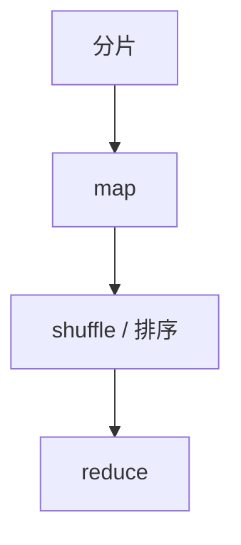
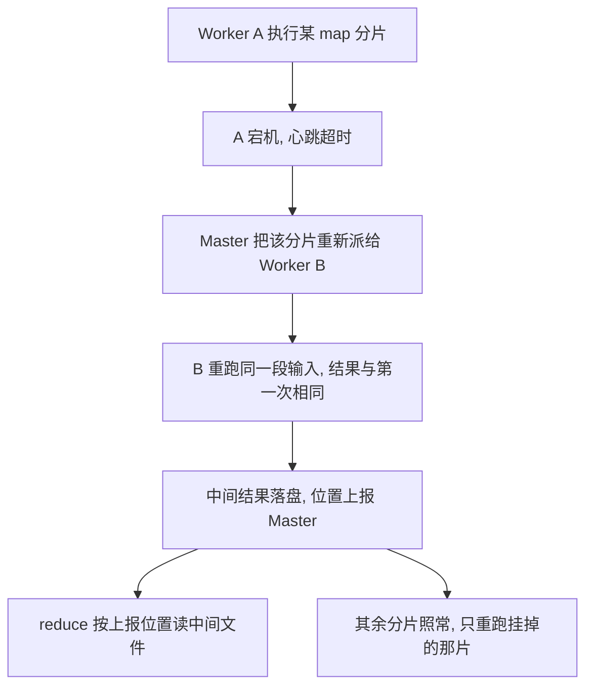

# MapReduce

把批处理收成 map 与 reduce 两次用户函数，中间用按键分区的排序连接；容错靠再执行任务，不靠分布式共享内存。

<footer>—— Dean and Ghemawat, MapReduce, OSDI 2004 / CACM 2008</footer>

[上一课](/cs/lakehouse-table-format)给出可共享的表快照。缺口是**如何在上千台机器上算**：不是新 SQL，是把函数接到分区洗牌。本课钉 MapReduce；Spark DAG 下一课去掉强制的两阶段。

## 问题

全表扫描 + 分组聚合：map 发射 `(k,v)`，shuffle 按 `k` 聚集，reduce 做合计。缺口是调度与容错：一台 map 挂了，只重跑该分片；reduce 读的是持久化的中间文件。没有这套模型，湖上的文件只是静态。与并行 DBMS：MR 当初用松 schema 与廉价硬件换计划质量。

数字实例：统计 1 TB 日志的词频，若 "the" 出现 1 亿次且没有 combiner，map 端要为它发 1 亿条 ("the", 1)；在每台 map 机器先合并成 ("the", 本机小计)，shuffle 流量立刻从 1 亿条缩到接近机器数条——combiner 省的是网络，不是逻辑。

GFS 提供分片与复制。combiner 是可选的本地预聚合。记录条数不是负载：倾斜键会把一个 reduce 打满。

## 方法

输入分片 → map → 溢写排序 → 按分区拷到 reduce → 归并 → 输出。推测执行对付拖后腿。与湖仓：输入可以是表快照的文件清单。计数、倒排、连接（map 端或 reduce 端）都是同一骨架上的程序。

直觉类比：MapReduce 像集体改考卷——先把卷子分成 100 叠（分片），100 位助教各判一叠并按学号尾数写标签（map），再按尾数寄给 10 位统计员（shuffle），每人只加总自己的尾数组（reduce）。中途谁病了，把他那叠重判一遍就行，别人照旧。

```mermaid
flowchart TD
  IN["分片"] --> M["map"]
  M --> SH["shuffle / 排序"]
  SH --> R["reduce"]
```

## 机制

确定性的纯 map/reduce 使再执行等价于第一次。副作用（写外部）会打破这点——后课恰好一次要处理 sink。shuffle 是全对全的带宽税，也是倾斜的放大器：一键一个 reduce 打满，与 [Grace hash join](/cs/grace-hash-join) 的热键同构。combiner 在 map 端预聚合，像两阶段哈希聚合的 local agg。

```mermaid
flowchart TD
  A["Worker A 执行某 map 分片"] --> C["A 宕机, 心跳超时"]
  C --> M["Master 把该分片重新派给 Worker B"]
  M --> B["B 重跑同一段输入, 结果与第一次相同"]
  B --> D["中间结果落盘, 位置上报 Master"]
  D --> R["reduce 按上报位置读中间文件"]
  D --> N["其余分片照常, 只重跑挂掉的那片"]
```

为什么重要：再执行容错的前提是 map/reduce 纯函数——同样输入必得同样输出。谁在 map 里偷偷写外部系统，重跑就会重复扣款、重复发信；「恰好一次」语义要靠后课的 sink 规范兜住。常见误区则是以为机器越多越快：1 个热键占 90% 数据时，shuffle 会把 90% 压给一个 reduce，加机器救不了倾斜，得靠 combiner 或加盐拆键。

输出提交常用目录改名当原子，像切根。与并行数据库：MR 当初用松 schema 与廉价硬件换计划质量；SQL-on-Hadoop 后来把 GROUP BY 编译回同一骨架。推测执行对付拖后腿机器，不修复倾斜。

## 边界

本课不写 Hadoop 配置百科。下一课 DAG 允许多阶段与内存缓存，避免每次强制物化两跳。不把 MR 当流处理：窗口与 watermark 是后课。图迭代用多次作业很笨，那是 Spark 动机。

后课默认：批 shuffle 可理解成 MR；迭代与流水用 DAG。连接仍是 map-side 广播或 reduce-side 按键碰面。

## 小结

- MapReduce：分片函数 + 按键洗牌 + 再执行容错。
- 倾斜与 shuffle 是主要代价；combiner 减流量。
- Spark 与 DAG 下一课。
- 出处：Dean and Ghemawat, MapReduce, OSDI 2004。
