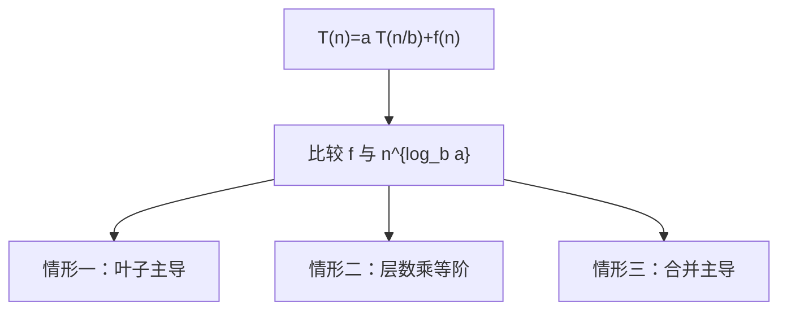

# 主定理

形如 $T(n)=aT(n/b)+f(n)$ 的递归，其渐近由 $f$ 与 $n^{\log_b a}$ 谁主谁从决定。

<footer>—— 据 Bentley, Haken and Saxe, A General Method for Solving Divide-and-Conquer Recurrences, 1980；CLRS 第 4 章整理</footer>

上一课[循环不变式](/cs/loop-invariant)给了迭代过程的正确性骨架。[渐近记号](/cs/loop-invariant)早已能写 $\Theta$。本课不重证大 $O$，也不把递归树画成百科。缺口是：后课分治会留下 $T(n)=aT(n/b)+f(n)$，循环不变式推不出这根式子的阶。本课只钉主定理的三种情形，把分治范式本身留给下一课。

## 问题

归并、二分、Strassen 乘法都把规模 $n$ 切成 $a$ 块、每块约 $n/b$，合并花 $f(n)$。递归树的层数是 $\Theta(\log_b n)$，叶子是 $n^{\log_b a}$。总代价是根上的 $f$、中间层、叶子三者之一主导。没有比较 $f$ 与 $n^{\log_b a}$ 的规则，每道题都要重画树。

缺口因此不是「递归是什么」，而是一条够用的判定：$f$ 多项式地小于、等于、或大于叶子阶时，$T(n)$ 分别是 $\Theta(n^{\log_b a})$、$\Theta(n^{\log_b a}\log n)$、$\Theta(f(n))$。规律性条件（对某个 $c\lt 1$ 有 $a f(n/b)\le c f(n)$）管第三种，本课点名不展开证明。

### 主定理不是所有递归

$T(n)=T(n-1)+\Theta(n)$ 不是等分，主定理不适用；那是等差求和。$T(n)=T(\lfloor n/2\rfloor)+T(\lceil n/2\rceil)+\Theta(n)$ 要地板函数引理，CLRS 用替换法补。本课默认 $n/b$ 写法已经光滑。

Akra–Bazzi 处理不等分；本课不启用。Bentley–Haken–Saxe 的递归树是同一套几何级数比较。后课只引用三种情形的结论。

## 方法

先算临界指数 $\log_b a$。把 $f(n)$ 与 $n^{\log_b a}$ 比多项式因子：若 $f=O(n^{\log_b a-\varepsilon})$ 对某 $\varepsilon\gt 0$，叶子赢；若 $f=\Theta(n^{\log_b a})$，每层同阶，乘 $\log n$；若 $f$ 更大且规律，根上的 $f$ 赢。

替换法仍是后盾：猜对阶再归纳。主定理只是常见等分的快捷方式。本课不把主定理证完；树的层和几何比在 CLRS 4.5–4.6。

## 机制

有了三种情形，后课写归并 $T(n)=2T(n/2)+\Theta(n)$ 直接落在情形二，$\Theta(n\log n)$；二分查找 $T(n)=T(n/2)+\Theta(1)$ 是情形二的退化，$\Theta(\log n)$。正确性仍走递归假设或循环不变式，本课只管代价。

不要把 $\log$ 底写进 $\Theta$：底是常数。也不要把 $a$、$b$ 当输入规模；它们是算法切法的参数。

## 边界

主定理不处理减而治之、不处理期望递归、不处理最坏与平均混写。快排的期望是[后课](/cs/quicksort-expected)另开的指示器分析。不规则 $f$（在临界附近振荡）可以掉出三种情形，那时退回递归树或 Akra–Bazzi。

后课默认：看到等分递归，先套主定理再谈实现。分治作为设计法，下一课才命名。

## 小结

- $T(n)=aT(n/b)+f(n)$ 由 $f$ 与 $n^{\log_b a}$ 的多项式比较分三种情形。
- 不是所有递归都能套；减一、不等分要另法。
- 本课只给阶，不给分治的正确性模板。
- 出处：Bentley, Haken and Saxe, 1980；CLRS 第 4 章。
