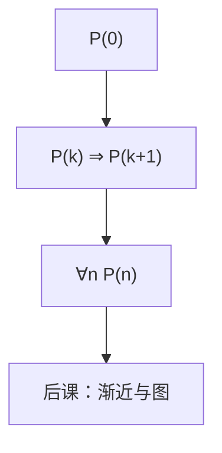

# 数学归纳

要证明每个自然数都有某性质，只需验证 $0$，再证明「若 $n$ 有则 $n+1$ 有」。

<footer>—— 据 Rosen, Discrete Mathematics and Its Applications 整理</footer>

上一课[函数与可数](/cs/functions-countable)钉死了 $\mathbb{N}$ 可作编号。本课不重证可数，也不从「公理化算术」另起。缺口是：可数只说有一份清单，没有工具证明「清单上每一个都满足 $P$」。后课循环不变式、递归结构、树的性质，都要把 $P$ 沿 $\mathbb{N}$ 推过去。

## 问题

对有限 $n=5$ 可以穷举。对所有 $n$，穷举不是证明。缺口因此不是新的集合，而是归纳法则：若 $P(0)$，且 $\forall k\,(P(k)\Rightarrow P(k+1))$，则 $\forall n\,P(n)$。强归纳把假设加强成「小于 $n$ 的都真」；对递归定义的结构（树、公式），换成结构归纳：对子对象成立则对对象成立。

本课只钉这套格式。渐近记号是下一课：归纳证明正确，不自动给出 $O(n^2)$。

### 归纳假设不是「想当然成立」

必须写清 $P(k)$ 的语句，再在 $k+1$ 的论证里**调用**它。只检查前几项再写「依此类推」，不是归纳。基础步选错（从 $1$ 起却漏了 $0$，或树归纳漏了空树）会整棵倒掉。

Rosen 把归纳与递归定义对照：自然数、阶乘、树高。后课[循环不变式](/cs/loop-invariant)把同一法则用在循环轮次上；本课先在 $\mathbb{N}$ 上钉格式。

## 方法

写 $P(n)$；证 $P(0)$；假设 $P(k)$ 证 $P(k+1)$。对象若按大小递归定义，对定义的每条规则给一步。常见错误：在 $k+1$ 步用了 $P(k+1)$ 自身。

## 机制

递归函数的终止与正确性用归纳：参数变小的调用对应更小的 $n$。后课图若无环，可以沿拓扑序归纳；有环则这条路断——那是[树作为无环连通图](/cs/tree-as-acyclic)才强调的。本课不把图请进来，只把 $\mathbb{N}$ 上的梯子搭好。

归纳也能证不等式，给下一课 $\Theta$ 的具体函数比较当工具，但 $O$、$o$ 的定义本身不是归纳。

## 边界

本课不引入超限归纳、序数。也不把数学归纳法与「实验归纳」混名。Peano 公理的其他条（后继单射等）不展开。

后课默认：对全体自然数或全体有限树的命题，用归纳写；循环的轮次归纳是同一法则的实例。

## 小结

- 归纳 = 基础 + 前一步推出后一步（或全体更小）。
- 递归定义的对象用结构归纳。
- 正确性归纳不代替代价分析；渐近是下一课。
- 出处：Rosen, *Discrete Mathematics*。
