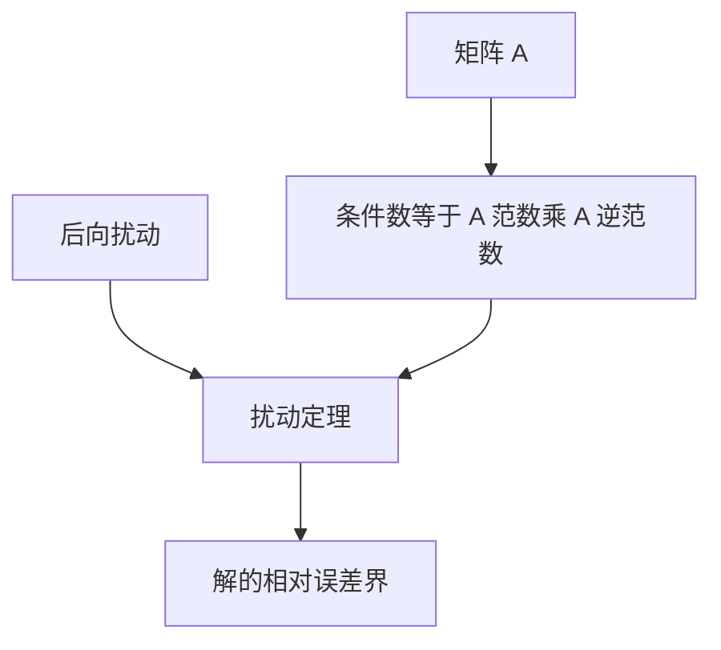

# 矩阵范数与扰动

向量范数量解的大小；算子范数量矩阵作为映射能拉伸多少。两者一起，才写出 $Ax=b$ 的条件数与扰动界。

<footer>—— 据 Trefethen and Bau, Numerical Linear Algebra；Golub and Van Loan, Matrix Computations；Higham, Accuracy and Stability of Numerical Algorithms 整理</footer>

上一课[高斯消元与主元](/cs/gaussian-pivoting)给出带主元的 $LU$。本课不重做换行，也不从抽象赋范空间另起。缺口是：条件数课留下了「$A$ 接近奇异则病态」，**还没有可计算的 $\kappa(A)=\|A\|\,\|A^{-1}\|$**，因而无法把残量翻译成解的误差界。消元的后向扰动 $\Delta A$ 要用同一种范数来读。

## 问题

向量范数 $\|\cdot\|$ 给 $x$ 一个尺度。诱导矩阵范数 $\|A\|=\sup_{x\neq 0}\|Ax\|/\|x\|$，于是 $\|Ax\|\le\|A\|\,\|x\|$。缺口因此不是再列三种常见范数的公式，而是**让扰动定理能开口**：若 $(A+\Delta A)(x+\delta x)=b+\delta b$，则在合适小性条件下，相对 $\|\delta x\|/\|x\|$ 被 $\kappa(A)$ 乘上数据的相对扰动（再除以 $1-\kappa\|\Delta A\|/\|A\|$ 一类因子）控制。上一课的残量对应某种 $\delta b$ 或 $\Delta A$；没有范数，残量只是一串数。

常用：$\|\cdot\|_2$ 与谱，$\|\cdot\|_\infty$ 与行和，$\|\cdot\|_1$ 与列和。本课只要求：一旦选定，条件数与后向误差用同一个。换范数会改 $\kappa$ 的数值，不改「病态」的定性，只要范数等价。

### 范数大不是「矩阵更病态」

$\|A\|$ 大可以被缩放解释；$A^{-1}$ 同时变小。病态是乘积 $\kappa$。只看行列式、只看最小对角元，都会误判。特征值接近 0 在 2-范数下与 $\kappa_2=\sigma_{\max}/\sigma_{\min}$ 相关，但非正规矩阵的特征值可以骗人——本课点名奇异值比特征值更贴 $\kappa_2$，不把 SVD 课写完。

Trefethen and Bau 前几讲就是范数、$\kappa$、后向稳定。Golub and Van Loan 给出标准扰动定理。Higham 把同一界接到实际残量。本课不证完备性。

## 方法

对 $Ax=b$，$A$ 可逆：$\kappa(A)=\|A\|\,\|A^{-1}\|\ge 1$。相对后向误差小则相对前向误差 $\lesssim\kappa$ 倍。残量 $r=b-A\hat x$ 满足 $A(x-\hat x)=r$，故 $\|x-\hat x\|/\|x\|\le\kappa\,\|r\|/(\|A\|\,\|x\|)$。这把消元课的「看残量」接成可算的前向估计。

预条件、平衡缩放，是在换一个 $\kappa$ 更小的等价问题再解。那是算法策略，问题 $Ax=b$ 的原始 $\kappa$ 仍在；你交回去的 $\hat x$ 仍要用原 $A$ 来解释。

## 机制

诱导范数把矩阵当成最坏方向上的拉伸。$A^{-1}$ 的拉伸是「解对数据有多敏感」的另一半。两者相乘，正好是条件数课在线性映射上的实例。消元即使后向稳定，只保证 $\Delta A$ 相对 $\|A\|$ 为 $O(u)$；乘上 $\kappa$ 之后，前向仍可丢掉所有位数。迭代法下一课会用同一套范数谈收缩：收敛的是误差在某种范数下变小。

分量扰动与范数扰动可以给出不同图像：某几个未知量极敏感，其它不敏感时，范数 $\kappa$ 会把最坏方向当成全体。分量条件数更细，本课不展开，但解释了「残量还可以、个别分量已经飞了」。平衡（对行或列对角缩放）改变 $\kappa$ 的数值，是合法的预处理：你解的是缩放后的系统，再把解缩放回去。迭代法下一课用 $\|G\|$ 谈收缩，用的是同一套诱导范数；谱半径给出更紧的渐近，瞬态仍可能先由范数描述。

## 边界

本课不把所有等价范数不等式列完，不讲分量条件数。下一课[迭代法何时收敛](/cs/iterative-solver-converge)用谱半径与范数讨论迭代。后课默认：$Ax=b$ 的 $\kappa(A)=\|A\|\,\|A^{-1}\|$；残量界要连同 $\kappa$ 读；主元不降低这个 $\kappa$。

## 小结

- 诱导范数给矩阵一个拉伸量；$\kappa$ 是 $\|A\|\,\|A^{-1}\|$。
- 后向扰动经 $\kappa$ 变成前向误差界。
- 残量小且 $\kappa$ 大时，解仍可以差。
- 下一课用范数看迭代误差是否收缩。
- 出处：Trefethen and Bau；Golub and Van Loan；Higham。
