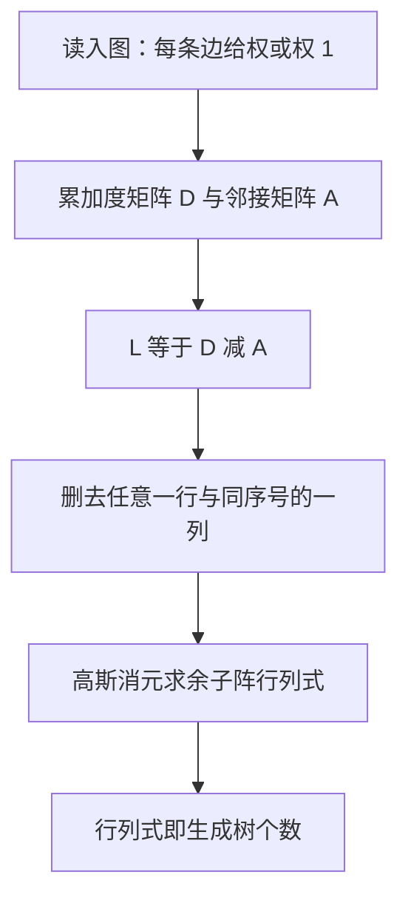
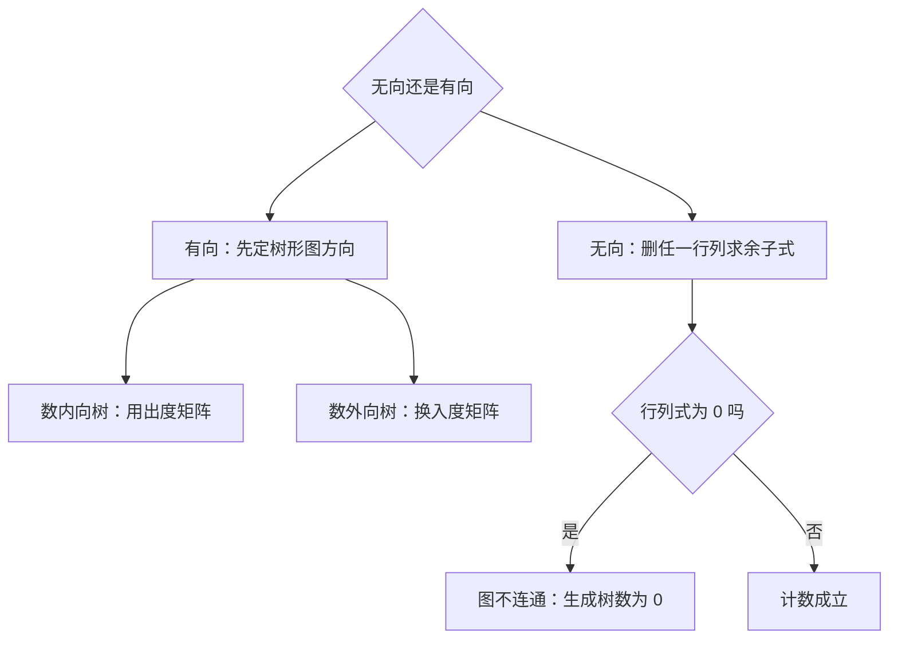

# 矩阵树定理

生成树的个数等于拉普拉斯矩阵任意一个主子式的行列式——Kirchhoff 在 1847 年解电路方程时顺手写下的定理。

<footer>—— G. Kirchhoff, 1847 电路分布论文；矩阵树定理原始出处</footer>

[上一课](/cs/kitamasa)在序列上用多项式取模压指数；这一课把图钉进矩阵，用一个行列式数清所有生成树。缺口是 **矩阵树定理**：从 $O(2^m)$ 的枚举降到 $O(n^3)$ 的消元。本课写无向图计数与有向树形图变体，不写 BEST 定理的完整推导与谱图理论全貌。

## 问题

数生成树：暴力枚举边集再判树是指数级；枚举「删 $m-n+1$ 条边」也不可见。代数路径是把「树」这个组合条件翻译成矩阵的秩与行列式。缺口：一个可编程的 $O(n^3)$ 计数器，顺带覆盖带权版本与有向版本。本课不写生成树逐棵枚举、不写复杂度意义下的计数困难类。

术语翻译：Laplacian 拉普拉斯矩阵 = 度矩阵减邻接矩阵；principal minor 主子式，即删去同序号一行一列所得的子方阵；arborescence 树形图，指定根的有向生成树。

## 方法

三步：构造 $L=D-A$；删去任意一行与同序号的一列；对余子阵求行列式。模素数下用高斯消元算行列式——每步选主元消列，主元乘进答案，交换两行变号一次。

带权版：边权 $w$ 解释为「该边独立出现的权重」，行列式输出所有生成树边权乘积之和；想数方案就把权全设为 $1$。

数字实例：三角形 $K_3$ 的拉普拉斯为三阶矩阵、对角全 $2$、非对角全 $-1$；删第三行第三列得 $\begin{pmatrix}2&-1\\-1&2\end{pmatrix}$，行列式 $=4-1=3$——三角形恰有 $3$ 棵生成树，手数一遍正好对上。

## 机制

为什么行列式数得清树：连通图的 $L$ 秩恰为 $n-1$，全一向量躺在零空间里；柯西–比内把主子式的行列式展开成选列方式之和，非树的选法因列重复而抵消为 $0$，每棵生成树恰好贡献一份——行列式读出的正是树的个数。有向版本只改度数方向：数以 $r$ 为根的内向树形图（各点沿有向边走向 $r$）用**出度**矩阵，外向树换**入度**，删去的行列固定为根那一行列。

常见误区：不删行列直接算 $L$ 的行列式——全一向量使 $L$ 必奇异，行列式恒为 $0$，于是得出「没有生成树」的荒谬结论。错在把奇异的整阵扔给了定理，定理要的是主子式。

## 边界

计数永远走模素数的整数消元——浮点行列式在 $n$ 上百时就靠不住，错在舍入不可控。与 [min-cut-applications](/cs/min-cut-applications) 共享同一张拉普拉斯的脸：那边用它架谱与割的桥，这边只用它的行列式。定理只给个数不给清单——需要逐棵列出生成树时它帮不上忙。删哪一行列都行是性质不是巧合：连通图的所有主子式同值。

直觉类比：把每条边换成一欧电阻，拉普拉斯就是电路的导纳矩阵；删行删列相当于把一个节点接地。接哪个点都不改变能数出的回路结构——「任删一行列」等价于「随便挑一个接地点」。

## 小结

- 生成树个数 = 拉普拉斯任一主子式的行列式，$O(n^3)$ 可编程。
- 度数方向定内外向树形图版本，删去根所在的行列。
- 行列式为 $0$ 即不连通，定理顺带当连通性体检。
- 出处：G. Kirchhoff, 1847；N. Biggs, *Algebraic Graph Theory*；Chaiken 与 Kleitman 的矩阵树定理推广, 1978。
