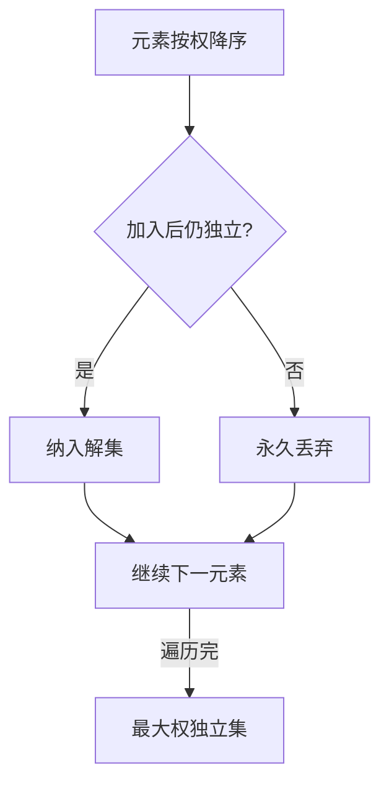
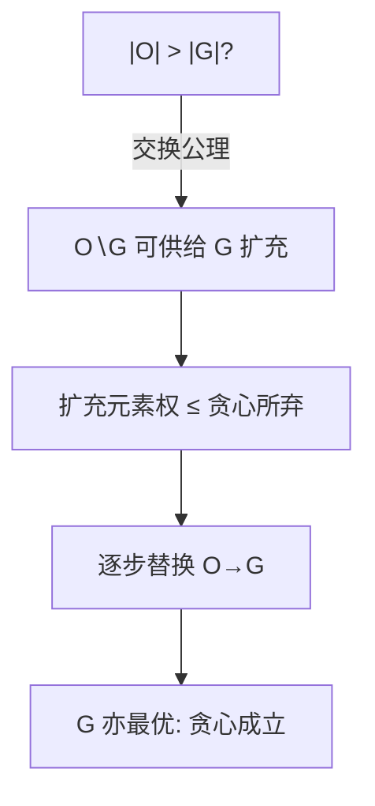

# matroid-theory

贪心为什么有时对有时错？拟阵给出裁决线：独立系满足交换公理，贪心就从局部最优走到全局最优。

<footer>—— 据 Whitney (1935) 拟阵公理；Edmonds (1971) 贪心与交并</footer>

[Slope Trick](/cs/slope-trick) 用凸性担保 DP 转移的安全，本课用**交换性**担保贪心的安全。最小生成树里 Kruskal 从不出错，同样的「每次挑最便宜」换到别的场景就翻车——缺口是给出贪心可用的精确条件：**拟阵**。本课不展开图拟阵以外的几何或表示论内容。

## 问题

拟阵是一个二元组 $M=(E,\mathcal I)$：$E$ 是_ground set_，$\mathcal I\subseteq 2^E$ 是独立集族，满足三公理——空集独立；独立集的子集独立（遗传）；两个独立集若 $|A|\lt|B|$，则存在 $x\in B\setminus A$ 使 $A\cup\{x\}$ 仍独立（交换）。问题：为什么交换公理恰好是贪心的生死线？

术语翻译：ground set（底集）= 候选元素全体；independent（独立）= 被认可的可行集合；rank（秩）= 最大独立集的大小，$r(A)$ 也读作「$A$ 的秩」。

数字实例：图拟阵 $M_G$——$E$ 是边集，独立 = 无环（森林）。$A=\{\}$、$B=\{$ab, bc$\}$，交换公理给出可从 $B$ 拿 ab 接进 $A$。这正是 Kruskal 每步「能不能接」的形式化。

## 方法

拟阵上的**贪心定理**：给每个元素权重，要求最大权独立集，按权从大到小试插、能插则插，全局最优。算法与 Kruskal 同构：排序、逐一 try-include。判独立用并查集（图拟阵）或按拟阵类型定制的 oracle。

直觉类比：拟阵像「乐高自由拼」——任何合法拼好的两个作品，小的那个永远可以从大的那里搬一块过来接着拼（交换公理）。贪心敢「只看眼前最贵的一块」，正因为搬块永远不锁死后路。

## 机制

证明骨架用交换：设贪心解 $G$、最优解 $O$，若 $|O|\gt|G|$，交换公理保证能从 $O\setminus G$ 取元素扩 $G$ 仍独立；又因贪心按权序取过该元素却没取，说明权不大于 $G$ 中对应元素——不断替换后 $O$ 可变成 $G$，故 $G$ 也是最优。秩函数 $r(A)=\max\{|I|:I\subseteq A, I\in\mathcal I\}$ 满足次模性，是「贪心+凸」在这片土地上的对应物。

数字实例：两独立集 $A=\{$重边 ab$\}$、$B=\{$ac, bc$\}$ 构成三角形森林拟阵。交换公理迫使 ab 可补进或与 B 中一条互换——Kruskal 删环重选正是在这条公理上滑动。

常见误区：把「贪心某次对了」当成「问题有拟阵结构」。经典反例：币值 1、3、4 的找零，贪心 4+3+3+1 用 4 枚，最优 4+4 用 2 枚——找零系统的独立集不满足交换公理，贪心无靠山。

## 边界

判断一个具体问题是否落在拟阵上，常用「它是不是某矩阵的线性无关列」（线性拟阵）或「某图的森林」（图拟阵）来认领。两个拟阵的**交**上的最大独立集问题，贪心失效，要用 Edmonds 的交算法（多项式但复杂度高）；三个及以上拟阵交已是 NP-hard。拟阵并、对偶拟阵是进阶工具，本课只立路标。

直觉类比：单个拟阵像一条「只进不退」的单行道，贪心直行即达；拟阵交像两条单行道交叉，直行会撞，需要信号灯（增广路算法）调度。

## 小结

- 拟阵 = 遗传 + 交换的独立系；交换公理是贪心定理的生死线。
- Kruskal 是图拟阵上贪心定理的实例；秩函数次模。
- 双拟阵交多项式可解，三拟阵交 NP-hard——工具边界要认得。
- 出处：Whitney「On the Abstract Properties of Linear Dependence」1935；Edmonds「Matroids and the Greedy Algorithm」1971。
