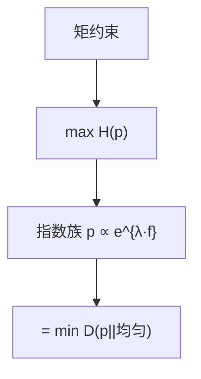

# 最大熵原理

只知道若干期望约束时，选使 $H$ 最大的 $p$——等价于相对均匀分布的 KL 最小；指数族由此出现。

<footer>—— 据 Jaynes, Information Theory and Statistical Mechanics, 1957；Cover and Thomas 整理</footer>

上一课[KL 与交叉熵](/cs/kl-cross-entropy) 给出 $D(p\|q)$。缺口是**选分布**：约束 $\mathbb{E}_p[f_i]=a_i$，其余未知。Jaynes：最大化 $H(p)$，或 $\min D(p\|u)$（$u$ 均匀）。拉格朗日得 $p(x)\propto\exp(\sum\lambda_i f_i(x))$。信息单元以此收束，下一单元数论。

## 问题

约束不足时，分布不唯一。再人为加峰会引入没有证据的信息（KL 意义下相对均匀更远）。最大熵选最平的那个。有均值约束的实直线上得指数分布；有均值方差得高斯——在给定支撑与测度下。离散字母表上，无约束即均匀，熵最大 $\log|\mathcal{X}|$，与[熵课](/cs/entropy-bits) 一致。

不是「自然界最大化熵」的物理学断言；本课当推理规则。统计力学是 Jaynes 的动机，不是本栏主线。

### 不是最大似然的别名

有了完整 i.i.d. 样本，MLE 另说。最大熵用于**矩约束**而非整份经验分布。经验分布本身已是一种最大熵（无额外约束时在类型上）。

Jaynes 1957。Cover–Thomas 第 12 章。Csiszár 的 $I$-投影：约束凸集上最小 KL。本课不把 CRF 特征当主例子。

## 方法

写拉格朗日：$H+\sum\lambda_i(\mathbb{E}f_i-a_i)$。指出解在指数族。对偶：$\lambda$ 使约束满足。强调：换参考测度 $q_0$ 则 $\min D(p\|q_0)$，指数里多一个 $\log q_0$。

## 机制

信息与编码课序结束：信源、信道、有损、相对熵、选分布。后文密码数论不再用 $R(D)$，除非点名。最大熵给「缺省分布」一个信息论名字，避免在逻辑单元用概率时偷偷换先验而不声明。

与 Kolmogorov：最大熵是分布层；$K$ 是单串。

$I$-投影：在凸约束集上 $\min D(p\|q_0)$ 唯一（严格凸）。最大熵是 $q_0$ 均匀的特例。经验矩当约束时，解随样本变，这是统计，不是再定义 $H$。信息单元到此：五把尺子 $H,C,R(D),D,\max H$ 都有了。

## 边界

本课不证大偏差的 Sanov 全文，不引入热力学极限。不把机器学习的正则当 Jaynes。后课默认：只有矩时，缺省 $p$ 是最大熵指数族。下一课模运算，为密码准备。

约束不足时最大熵给缺省分布，不是声称物理系统在最大化 $H$。指数族由拉格朗日出现。下一单元改做模算术，不再用 $R(D)$。

上一课留下的缺口在本课收口；「最大熵原理」进入后课词汇表后只引用。文献用来钉对象与边界，不把本课写成该主题的独立综述。

## 小结

- 矩约束下选 $\max H$ 的 $p$，得指数族。
- 等价于相对均匀（或参考测度）的最小 KL。
- 是推理规则，不是物理定律课。
- 出处：Jaynes, 1957；Cover and Thomas。
