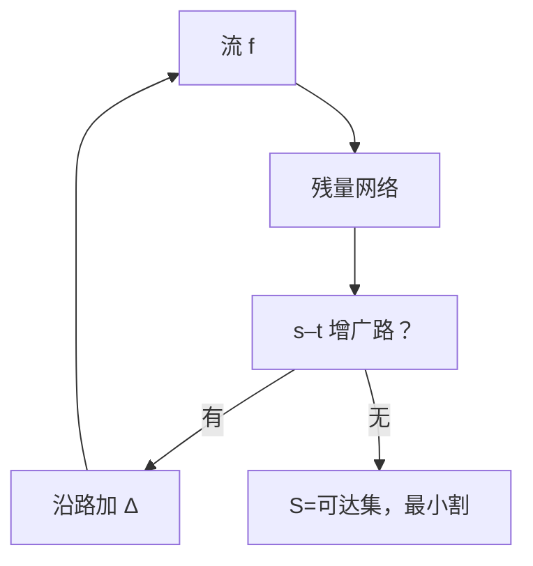

# 最大流 Ford–Fulkerson

源到汇的最大流量等于最小割的容量；沿残量网络增广，直到没有 $s$–$t$ 路。

<footer>—— 据 Ford and Fulkerson, Maximal Flow Through a Network, 1956；CLRS 第 26 章整理</footer>

上一课[Kruskal 与 Prim](/cs/mst-kruskal-prim)处理无向边权之和。流网络是有向边、容量、源 $s$ 与汇 $t$。本课不重做生成树。缺口是：合法流（容量约束、守恒）的最大值，以及用残量路上的增广来算。本课只钉 Ford–Fulkerson 方法与最大流最小割。

## 问题

流 $f$ 满足 $0\le f(e)\le c(e)$，除 $s,t$ 外流入等于流出。值 $|f|$ 为 $s$ 净流出。残量图：正向剩余 $c-f$，反向 $f$（可退流）。若残量里有 $s$–$t$ 路，沿路加 $\Delta$ 仍合法且值增大。没有残量路时，$s$ 侧可达集给出最小割，容量等于 $|f|$。

缺口不是线性规划，而是这条组合算法。整数容量时若每次 $\Delta\ge 1$，有限步终止；病态选择可使增广次数随容量指数，Edmonds–Karp 用 BFS 最短增广把迭代变成 $O(VE^2)$。

### 方法不是单一实现

Ford–Fulkerson 是「只要有增广路就增」的框架。最短路增广（Edmonds–Karp）或 Dinic 分层是后继实现。本课证明框架正确 + 最大流 = 最小割；实现默认用 BFS 找路，接上[无权 BFS](/cs/bfs-unweighted)。

Ford–Fulkerson 1956。割是顶点划分，容量是前向边容量和。反向边在残量里出现，不是原图多出来的物理管道。

## 方法

$f\leftarrow 0$。循环：在残量上找 $s$–$t$ 路，算瓶颈 $\Delta$，更新 $f$ 与残量。无可增广路则停。割 $(S,T)$：$S$ 为残量中 $s$ 可达。

有理容量有限终止；无理容量可无限，主干用整数。

## 机制

守恒使任意割的净流等于 $|f|$，故 $|f|\le$ 任何割容量。增广结束时 $|f|$ 达到某割，故最大。二分图匹配可化成单位容量网络，本课点名：最大匹配 = 最大流，不写匈牙利。

不要把 MST 的割与流的割混名：一个选边权最小连通，一个是容量之和最小的 $s$–$t$ 划分。

## 边界

本课不写费用流、不写推送重标。多源多汇加超级源汇即可。容量随输入指数时要小心增广次数；Edmonds–Karp 给出多项式。下一课离开图，进入串匹配。

后课默认：最大流 = 反复增广；最大流最小割；整数容量 + 最短增广多项式。

## 小结

- 残量增广直到无 $s$–$t$ 路；此时流最大、割最小。
- 框架叫 Ford–Fulkerson；BFS 增广即 Edmonds–Karp。
- 整数容量保证终止。
- 出处：Ford and Fulkerson, 1956；CLRS 第 26 章。
