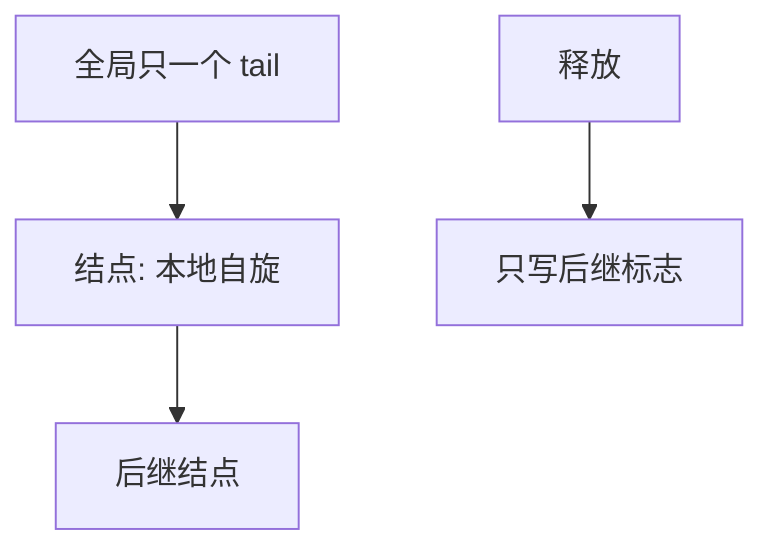

# MCS 锁

每位等待者在自己的结点上自旋，只在前驱释放时被打醒；于是锁争用不再变成所有核对同一 cache 行的轮番失效。

<footer>—— 据 Mellor-Crummey and Scott, Algorithms for Scalable Synchronization, TOCS 1991 整理</footer>

[上一课](/cs/spinlock)的 TAS 锁让所有核打同一锁字，MESI 行在核间弹跳，核数上升后获取延迟爆炸。缺口是 **MCS**（或同类排队锁）：每个 CPU 一个队列结点，自旋在**本地标志**上，释放者只写后继的标志。本课钉这个结构，不把每一种公平锁变体写完。

## 问题

全局锁字是共享热点。[原子 RMW](/cs/atomic-rmw) 无法取消「大家都要看见锁状态」这一事实，但可以把「我是否轮到」放到每核私有行上。MCS：入队用 CAS 把 `tail` 指到自己的结点并链上前驱；若有前驱则在自己的 `locked` 上自旋。释放：若无后继则 CAS 清 `tail`，否则写后继 `locked=0`。缺口不是关 IRQ 的纪律（仍然要），而是**等待的局部性**。

结点必须在入队期间保持地址稳定，通常是栈上局部量或 per-CPU 结点。持锁时不能睡，与普通自旋相同。

## 方法

获取：初始化本结点，原子交换进尾，链好，自旋本地。释放：看后继指针；若空则尝试把尾从自己 CAS 成空；有后继则 store 其标志。公平：队列 FIFO，无饥饿于「后来者插到 TAS 成功」那种。与[内核抢占](/cs/kernel-preempt)：持 MCS 仍关抢占。

Linux `qspinlock` 是压缩版直觉近亲，主干不转写源码。

## 机制

MCS 把 RMW 热点收成对 `tail` 的短 CAS，长等待发生在私有行上，扩展性好。它不缩短临界区：临界区仍须短。也不允许睡眠：队列结点在栈上，睡了栈可能被别的路径复用。用户态长时间等待仍应进 futex，而不是 MCS 空转一个量子。

## 边界

本课不把 CLH、K42 锁的全部比较写成综述。NUMA 上还可再分层（本地队列再全局），那是工程，对象仍是排队。mutex 如何在拿不到时睡，下一课。

后课默认：多核短临界区可用排队自旋。线程上下文里等得久应让出 CPU，下一课 mutex 与休眠。

## 小结

- MCS：本地自旋、FIFO 排队，减轻锁字乒乓。
- 仍禁睡眠、临界区仍短。
- 可睡眠互斥是下一课。
- 出处：Mellor-Crummey and Scott, *TOCS* 1991；Love, *LKD*。
