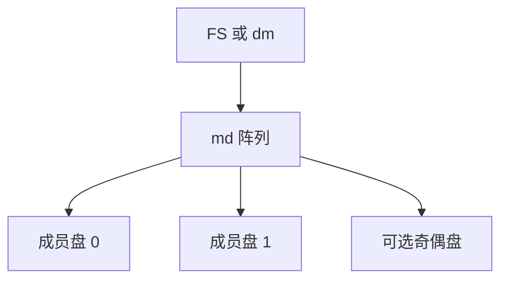

# md 软 RAID

md 在内核里把多块盘组成线性、0/1/4/5/6/10 等阵列：超级块记下角色，bitmap 加速恢复，/dev/md* 仍是一块块设备。

<footer>—— 据 Linux MD RAID 文档；Patterson, Gibson, Katz, A Case for Redundant Arrays of Inexpensive Disks, SIGMOD 1988</footer>

[上一课](/cs/device-mapper-lvm)用表拼接空间。冗余可以走 dm-raid，也可以走更老的 **md**。缺口是软 RAID 作为块设备：条带、镜像、奇偶，以及重建——写洞留给下一课。

## 问题

单盘故障丢数据。RAID1 写两份；RAID0 只条带不冗余；RAID5/6 用奇偶。md：每盘尾部或前部超级块描述成员，装配出 `/dev/md0`。缺口：reshape、热备、坏块列表、写意图位图（避免整盘 resync）。与 SCSI/NVMe 无关：成员是任意块设备。本课不把硬件 RAID 卡的固件写进来。

chunk 大小影响 FS 块组对齐。外部元数据与 IMSM 等格式存在，教学以原生 md 超级块为准。

## 方法

写 RAID1：克隆 bio 到两成员，都完成后才完成上层。写 RAID0：按 chunk 选盘。读可从较空闲镜像腿。故障：标记坏腿，热备接替，恢复线程拷数据。对照 LVM：md 的对象是冗余几何，不是灵活扩容（虽可线性）。对照 [FS 校验](/cs/fs-checksum-scrub)：md 不默认端到端校验用户数据（除非额外 integrity target）。

## 机制

软 RAID 用 CPU 与总线换独立 RAID 卡。它把「一块逻辑盘」的假象维持给 [VFS](/cs/vfs) 底下的 FS。性能与故障模式取决于级别——下一课专门讲级别与写洞。不要把 md 写成分布式一致性：成员假定在同一台机器的块层。

与调度器：每个成员有自己的队列；条带把一次逻辑写打成多次物理写。

实现上：reshape 改条带宽度时要搬数据，期间性能与失败模型都变。写意图位图不能替代奇偶正确性，只能缩短「整盘重算」的窗口。 读法上只引用[上一课](/cs/device-mapper-lvm)的结论，不把对象换成训练推理或限价簿。

本课在操作系统进阶的「存储栈 / 块层到设备」课序里，对象是 **md 软 RAID**。

- 先修只引用，不重导：上一课的结论当公理，本课只补差。
- 五栏不吞并：不把本课写成大模型训练/推理，也不写成限价簿或权重量化。
- 文献用 OSTEP、McKusick、内核文档与具名会议论文；不发明 arXiv 编号。

## 边界

本课不引入 cluster MD。不保证 USB 盘做 RAID 的可靠性。下一课把 Patterson 的级别与 RAID5 写洞钉成明确缺口。

版本字段会变，课序钉的是机制对象「md 软 RAID」，不是某一主线内核的结构体名。
后课默认：md 提供冗余块设备。条带/镜像/奇偶的更新原子性裂缝，下一课写洞。

## 小结

- md 用超级块装配软 RAID，对上仍是块设备。
- 位图缩短恢复；校验数据仍宜在 FS 层。
- RAID 级别与写洞是下一课。
- 出处：Linux MD；Patterson et al., SIGMOD 1988；*OSTEP*。
