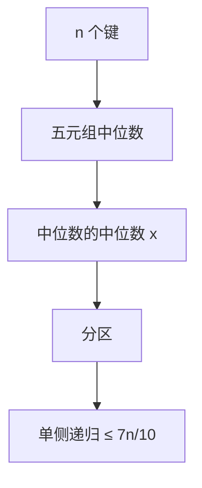

# 中位数的中位数

每五元组取中位数，再取这些中位数的中位数当轴；两侧都丢掉常数比例，选择最坏 $\Theta(n)$。

<footer>—— 据 Blum, Floyd, Pratt, Rivest and Tarjan, Time Bounds for Selection, 1973；CLRS 第 9 章整理</footer>

上一课[选择第 k 小](/cs/select-kth)给出随机分区的期望线性，并点名 BFPRT「最坏线性存在、常数大」。本课不重写单侧递归。缺口是把保证轴写完：为何五、为何丢掉至少大约三成，以及递推 $T(n)\le T(\lceil n/5\rceil)+T(7n/10+O(1))+O(n)$ 为何仍 $\Theta(n)$。后课图遍历不再问第 $k$ 小。

## 问题

随机选择最坏平方：对手每次送最偏的轴。要最坏线性，轴的秩必须落在 $[\alpha n,(1-\alpha)n]$ 一类区间，使丢掉的一侧至少 $\alpha n$。确定性构造：把 $n$ 个键分成 $\lceil n/5\rceil$ 组，每组五人取中位数；这 $\lceil n/5\rceil$ 个中位数再递归选它们的中位数 $x$。$x$ 至少大于（约）一半五元组里的三个键——「一半的一半的三」，约 $3n/10$ 个键严格在 $x$ 一侧，故另一侧至多约 $7n/10$。单侧递归规模 $\le 7n/10$，外加找各组中位数的 $O(n)$ 与对中位数数组的 $T(n/5)$。

缺口是这条比例，不是再发明分区。三元组或七元组也能证，五是教科书常数折中。

### 保证轴不是默认实现

每层对全部键做分组与两次选择，常数远大于随机分区。主干实现仍是上一课的随机。本课证明比较模型里选择的最坏上界与 $\Omega(n)$ 下界同阶。

Blum et al. 1973（BFPRT）。CLRS 9.3 用五元组画「大于 $x$ / 小于 $x$」的格子。主定理不能直接套两个不同 $b$，用替换法：猜 $T(n)\le cn$ 后留出 $c$ 吸收 $n/5+7n/10$。

## 方法

`Select(A,k)`：不足常数直接排。否则五五分组，各组中位数形成数组 $M$，递归 `Select(M, |M|/2)` 得 $x$。以 $x$ 为轴分区，得秩 $q$；与上一课一样只走一侧。正确性：分区仍对；$x$ 的秩保证两侧都 $\Omega(n)$。

[Akra–Bazzi](/cs/akra-bazzi) 也能读 $T(n/5)+T(7n/10)+O(n)$：$p=1$ 时积分给出 $\Theta(n)$。课内用替换法即可。

## 机制

格子论证要小心地板：大约 $3n/10$ 是渐近，小 $n$ 直接排序切开。不要把「中位数」当成均值：五元组中位数是比较出来的第 3 小。也不要把本课当排序：排完五元组只为造轴，全表仍无序。

后课 BFS 的「第 $k$ 层」不是顺序统计量；对象换成图。

## 边界

本课不优化 BFPRT 的常数，不处理同时多个顺序统计量。整数键上计数选择更快，那是[基数与桶](/cs/radix-bucket)的模型，本课钉比较模型。后课默认：第 $k$ 小最坏 $\Theta(n)$ 可及；数组算法收束，图从下一课起。

## 小结

- 五数取中保证轴两侧丢掉 $\Theta(n)$，选择最坏线性。
- 递推 $T(n/5)+T(7n/10)+O(n)=\Theta(n)$；常数大，实现仍可随机。
- 下界 $\Omega(n)$ 与上界同阶。
- 出处：Blum et al., 1973；CLRS 第 9.3 节。
