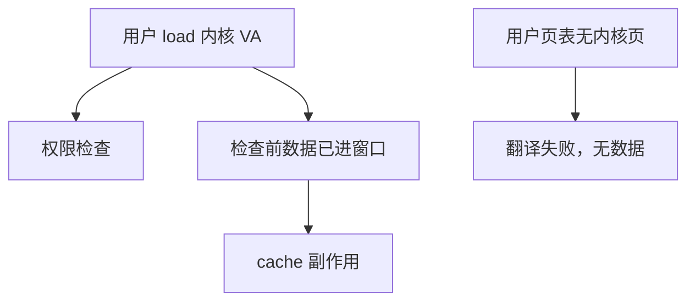

# Meltdown 与 KPTI

乱序允许 load 在权限检查完成前把内核映射的数据读进窗口；异常会冲刷寄存器，但缓存已经按那数据编过码。KPTI 让用户态页表里根本没有那一页。

<footer>—— 据 Lipp et al., Meltdown, USENIX Security 2018 整理</footer>

[上一课](/cs/spectre-variants) 的根是预测器。[退休与精确异常](/cs/retire-precise-exception) 保证故障指令不提交。许多核为了快，把「页表里有映射」的内核地址留在用户 CR3 里，靠权限位在使用时 trap。本课不给攻击步骤。缺口是 **Meltdown：故障路径上的瞬态 load，以及 KPTI 用两套页表堵住映射。**

## 问题

用户 load 内核地址：权限失败应 trap。若微结构先把数据送进依赖的推测 load 再检查，瞬态值可以当 [Spectre](/cs/spectre-variants) 那样的 cache 索引。缺口不是 BTB 训练，而是**权限检查相对 load 执行太晚，且内核地址在用户页表里仍翻译得通。**

KPTI（KAISER）：用户 CR3 不含内核映射（少量跳板除外），瞬态翻译失败，数据进不了窗口。代价是 syscall/中断多一次 CR3 切换与 TLB 压力，见 [TLB 层次](/cs/tlb-hierarchy-pwc)。

## 方法

硬件：先检查权限再写物理数据进流水，或故障 load 永不填用户可见 cache。软件：KPTI 分离页表。微码与新核的「幽灵缓解」改乱序许可。本课不讨论如何把瞬态值编进 cache 集。

## 机制

与 Spectre 的差别：不必误训练条件分支；依赖的是乱序与延迟 trap。KPTI 增加 [syscall](/cs/syscall-abi) 路径上的 TLB miss，是用翻译隔离换瞬态隔离。后续硅把 Meltdown 类关洞后，OS 可在部分 CPU 上关 KPTI 以收回性能。

PCID/ASID 让两套页表切换不必全冲 TLB，把 KPTI 税从「每次 syscall 冷 TLB」降到「换 ASID」。没有 PCID 的核上，KPTI 的 [大页覆盖](/cs/hugepage-tlb-reach) 收益也更明显。

## 边界

本课不把所有故障类瞬态变体点名。Rowhammer 下一课把「正确 cache 协议」换成 DRAM 行间漏电，不靠推测。Prime+Probe 是通用缓存侧信道，最后一课，Spectre/Meltdown 只是它的一种编码器。

后课默认：Meltdown 靠延迟权限 + 映射仍在；KPTI 拆映射。DRAM 扰动是另一物理层。

## 小结

- Meltdown：故障前的瞬态 load 留下缓存足迹。
- KPTI 用页表隔离，付 TLB 与 syscall 税。
- DRAM 行干扰是下一课 Rowhammer。
- 出处：Lipp et al., *USENIX Security*, 2018。
