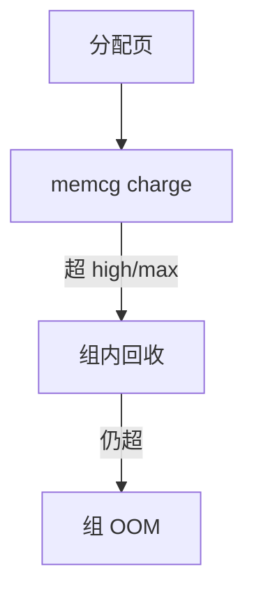

# memcg

memory cgroup 给一组进程一套计数器与上限：匿名、文件、内核、交换；超限则组内回收，再不行 OOM 该组。

<footer>—— 据 Linux cgroup v2 memory 文档；内核 memcontrol 说明</footer>

[blkio](/cs/blkio-cgroup) 限 I/O。[配额](/cs/fs-quota) 限盘。[NUMA](/cs/numa-mempolicy) 限节点。缺口是 **内存控制器**：容器不能吃光主机 DRAM。

## 问题

v2 `memory.max`：硬限。`memory.high`：先回收再可短暂超。记账：页进组，共享页按规则分或记到第一次接触者（实现随版本）。缺口：内核栈、slab、dentry 是否进 `memory.stat`；OOM killer 选组内任务；与 [zswap](/cs/zswap)/swap.max。本课不把 v1 层级与 v2 的每个文件对译完。

writeback 归属：脏文件页的 memcg 必须与 io 节流一致，否则绕过。THP、KSM 使记账粒度变粗或共享。

## 方法

分配：`try_charge` 该 css，失败则 `try_to_free_mem_cgroup_pages`（只扫该组 lru）。对照主机回收：全局 LRU vs 组 LRU。对照 [thin](/cs/thin-provisioning)：超分配在存储；memcg 是 RAM 硬壁。对照 rmap：回收仍靠反查 pte。

## 机制

memcg 把「容器内存隔离」收成内核会计，使多租户可共主机。它不加密内存、不防侧信道。不要写成云账单页。与网络 [rmem](/cs/socket-buffers)：套接字内存也可进 memcg（kmem），否则成为逃逸。

过小的上限导致抖动：不断回收文件页，CPU 打满，看起来像泄漏。

实现上：kernel memory 记账关闭时，dentry/inode 可被容器用来撑爆宿主。OOM 组选择看 usage 与 oom.group。swap.max 为 0 则回收只能丢文件页。 读法上只引用[上一课](/cs/numa-mempolicy)的结论，不把对象换成训练推理或限价簿。

本课在操作系统进阶的「内存进阶 / 回收、迁移与加固」课序里，对象是 **memcg**。

- 先修只引用，不重导：上一课的结论当公理，本课只补差。
- 五栏不吞并：不把本课写成大模型训练/推理，也不写成限价簿或权重量化。
- 文献用 OSTEP、McKusick、内核文档与具名会议论文；不发明 arXiv 编号。

## 边界

本课不引入 PSI 的全部指标解释。不保证 GPU 内存进同一控制器。下一课把缺页交给用户态处理：userfaultfd。

版本字段会变，课序钉的是机制对象「memcg」，不是某一主线内核的结构体名。
后课默认：组可被 memory.max 挡住并组内 OOM。用户态填页与迁移，下一课 userfaultfd。

## 小结

- memcg 对组收费并回收/OOM。
- 共享页与 writeback 归属是细节陷阱。
- userfaultfd 是下一课。
- 出处：cgroup v2 memory；Linux memcontrol；Gorman。
