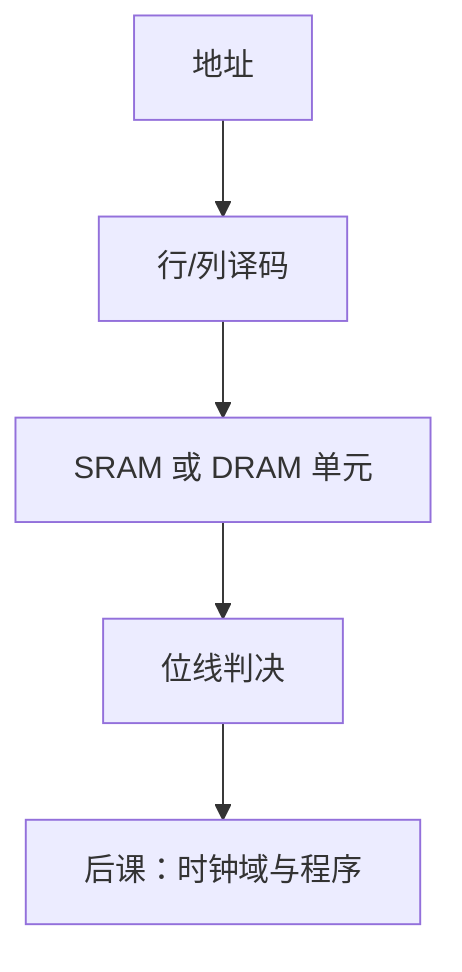

# SRAM 与 DRAM 阵列

寄存器存几十个字已经够贵；大批量比特改用阵列：静态交叉耦合一对，动态靠电容再定期刷新。

<footer>—— 据 Harris and Harris, Digital Design and Computer Architecture；Patterson and Hennessy, Computer Organization and Design (RISC-V) 整理</footer>

上一课[计数器](/cs/counter-circuit)可以扫描地址。本课不重讲模 $M$，也不从文件系统另起。缺口是：寄存器堆和 FF 按比特复制，存 KiB 以上不划算。需要**存储器阵列**：译码、字线、位线，以及 SRAM 与 DRAM 两种单元。

## 问题

$n$ 位地址应选出 $2^n$ 行之一，读出字。缺口是组织：行译码器点亮字线，单元把数据放到位线，灵敏放大器判决——第一课的判决在这里再次出现。SRAM 六管（或类似）交叉耦合，静态保持，与锁存同族、更密。DRAM 一管一容，密度高，读破坏性，必须刷新：计数器课的定时在此落地。

本课钉阵列与两种单元。Cache、虚拟内存是体系结构课，不在本课。

### DRAM 不是「更慢的 SRAM」

接口有行选、列选、预充电、刷新命令，延迟不是单周期 $t_{pd}$ 能概括。把主存当组合 ROM 画进单周期图，是教学抽象（Patterson 的组合数据存储器），实现上是 DRAM 控制器跨多拍——[多周期](/cs/multicycle-microcode)会碰到。SRAM 用作片上寄存器堆、Cache 体，延迟更接近若干门。

Harris 画 6T SRAM 与 1T1C DRAM。Patterson/Hennessy 把存储器延迟放进 CPU 性能。纠错码可加在阵列外，几何已在 ECC 课。

## 方法

地址拆行、列。读：字线开，位线差分放大。写：驱动位线再开字线。DRAM 刷新：周期内遍历行。端口：单口、双口 SRAM 改变线数与译码。

## 机制

指令与数据在后课存储程序里都放阵列上。单周期教材常把指令存储器当 ROM/SRAM 组合读。写使能必须相对时钟满足建立保持：存储器端口也是时序元件。DRAM 刷新与 CPU 访存争用，由控制器仲裁，本课只承认冲突存在。

## 边界

本课不讲闪存浮栅、磁盘磁层。不把 NUMA、一致性协议提前。电容怎样在硅上做出来，不是本课的电路问题。

后课默认：大批量存储是阵列；片上多用 SRAM，主存是 DRAM 加控制器。读出是判决后的比特串。

## 小结

- 阵列 = 译码 + 单元 + 位线判决。
- SRAM 静态保持；DRAM 电容须刷新、接口多拍。
- 寄存器堆是小而多口的 SRAM 特例，下一课之后才接到 ISA。
- 出处：Harris and Harris；Patterson and Hennessy, COD (RISC-V)。
