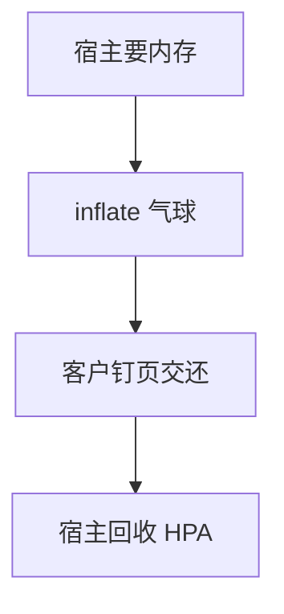

# 内存气球

气球驱动在客户里申请页并钉住还给 hypervisor：宿主回收这些框，客户 RSS 看起来仍在，实际可被超售。

<footer>—— 据 Waldspurger 对 ESX 气球的论述；virtio-balloon；[memcg](/cs/memcg) 与 [KSM](/cs/ksm) 为宿主侧对照</footer>

[时钟](/cs/clock-virtualization) 处理偷时间。内存超售另一钩：**气球**。缺口是客户配合 vs 宿主 [userfaultfd](/cs/userfaultfd) 回收。

## 问题

inflate：客户分配、告诉宿主 pfn 列表，宿主可拆 EPT。deflate：还页给客户。缺口：客户 OOM vs 宿主要内存；与 THP 拆页。本课不把每个 hypervisor 的目标 RSS 算法写完。

free page hinting 是气球亲戚：客户报告空闲。对象是合作回收，不是恶意。 

## 方法

宿主发 inflat 请求 → 客户气球驱动 → 页从客户 buddy 拿走。对照 memcg：限 QEMU 进程；气球限客户内。对照 [zswap](/cs/zswap)：客户自己也可 swap。对照 热插拔：balloon 更动态、非物理条。

## 机制

气球把超售从「宿主硬夺 EPT 导致客户随机缺页」变成「客户分配器参与」，更少破坏。不合作的客户会被硬回收或 swap 宿主。不要写成云规格谎言。与 [cgroup](/cs/cgroup-cpu-sched) 正交。

气球过大等于客户自己 OOM。

实现上：inflate 过猛等于在客户里制造 OOM。free page reporting 让宿主回收空闲而不必气球。与 KSM 一起用时，气球页不应被合并成假共享。 读法上只引用[上一课](/cs/clock-virtualization)的结论，不把对象换成训练推理或限价簿。

本课在操作系统进阶的「虚拟化与隔离进阶 / Hypervisor」课序里，对象是 **内存气球**。

- 先修只引用，不重导：上一课的结论当公理，本课只补差。
- 五栏不吞并：不把本课写成大模型训练/推理，也不写成限价簿或权重量化。
- 文献用 OSTEP、McKusick、内核文档与具名会议论文；不发明 arXiv 编号。

## 边界

本课不引入所有 stats。不保证 Windows 气球驱动行为。下一课把整机搬走：热迁移。

版本字段会变，课序钉的是机制对象「内存气球」，不是某一主线内核的结构体名。
后课默认：可合作收回客户页。不停机迁到另一宿主，下一课热迁移。

## 小结

- 气球让客户自己拿出页给宿主回收。
- 是内存超售的合作通道。
- 热迁移是下一课。
- 出处：Waldspurger；virtio-balloon；KVM。
