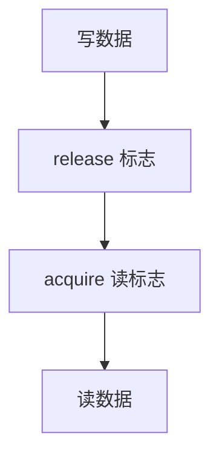

# 内存屏障

临界区括号若只是源码里相邻的两行，编译器与 CPU 都可以把共享访存挪出括号；屏障把它钉回程序员以为的顺序。

<footer>—— 据 Love, Linux Kernel Development；Lamport 顺序一致性与内核文档对 barrier 的整理</footer>

[上一课](/cs/race-critical)要求共享不变量只在临界区里改，但还没说机器是否按源码序提交那些访存。[存储一致性](/cs/memory-consistency) 在体系课给出 SC 与放宽模型。缺口是操作系统用法：**内存屏障**——防止编译器重排，并在弱序 CPU 上插入 fence，使「解锁前的写」被他核在「看到锁已释放」之前看见。本课不重导 TSO。

## 问题

无锁标志 `ready=1` 若排到 `data` 的写之前，读者看见 ready 仍可能读到旧 data。关中断不发射到别的核。缺口不是再定义竞争，而是承认：互斥锁的获取/释放必须带 **acquire/release** 语义，单独的 `LOAD`/`STORE` 要在文档化的点插 `smp_mb` 一类。内核把这写成显式屏障，而不是假设 SC。

编译器屏障挡住代码运动；CPU fence 挡住 store/load 在总线上的可见序。两者都要，对象不同。

## 方法

写者：更新数据，然后 `store-release` 标志。读者：`load-acquire` 标志，然后读数据。锁实现把 acquire 放在拿到锁之后、临界区之前，release 放在写完临界区之后、清锁字之前。本课不把每架构的指令助记符列完。

与[per-CPU](/cs/percpu) 的关系：本核独享的槽若从未被他核读，可少加屏障；一旦跨核，纪律回来。

## 机制

屏障让临界区在多核上「看起来像原子」成为可实现的：他核要么看不见区内中间态，要么还看不见锁已释放。没有它，上一课的交错论证只对顺序一致纸机器成立。设备 DMA 与内存之间还有另一道，属 I/O 课；本课对象是 CPU 之间。

过度屏障会毁掉流水线；内核习惯用最弱足够的 acquire/release，而不是每处全序 fence。

## 边界

本课不把 C++ 内存模型的全部 memory_order 枚举当 OS 正文，不写用户态如何探测乱序。也不把 RCU 的 synchronize 提前请进来。原子读改写指令本身既改数据又常自带屏障，下一课。

后课默认：跨核可见序要屏障或等价的锁语义。把「读改写」收成一条不可切的指令，下一课讲原子 RMW。

## 小结

- 临界区需要 acquire/release；源码相邻不等于可见序。
- 编译器屏障与 CPU fence 分工。
- 原子读改写是下一课。
- 出处：Love, *LKD*；体系课 [存储一致性](/cs/memory-consistency)。
