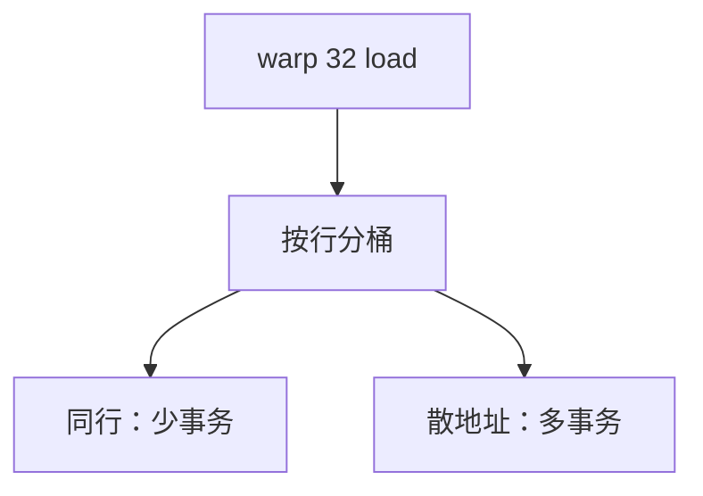

# 合并访存

一个 warp 的 32 个 load 若落在同一或少数 cache 行上，硬件合成一两次事务；地址散开则变成几十次，HBM 带宽被事务开销吃掉。

<footer>—— 据 NVIDIA CUDA 编程指南对 coalescing 的硬件规则；Lindholm et al. 整理</footer>

[上一课](/cs/warp-divergence) 处理控制不一致。即使掩码全 1，每个线程的指针也可以指向天南海北。[GPU 存储](/cs/gpu-memory-hierarchy) 的带宽数字假定突发传输。[CPU 写合并](/cs/write-combining) 是窄 store 的近亲。本课缺口是 **coalescing：把一个 warp 的访存收成尽量少的行事务。**

## 问题

warp 一拍发出 32 个 4B load。若地址构成连续 128B，一次事务即可。若每个线程跳 4KiB，可能 32 次独立事务，延迟无法被占用率完全隐藏，L2 与 HBM 命令总线饱和。缺口不是再切 warp，而是**硬件检测同行/同段，合并请求。**

规则随代际变（是否要对齐、是否允许 128B 段上的任意排列）。教学取：空间上落在少数 cache 行内则可合并；完全随机则不能。

## 方法

内存单元收集该 warp 本拍的地址，按行/扇区分桶，每桶一次事务，数据回填再按线程分发。共享存储则按 bank：同一 bank 不同地址冲突，广播同地址可合并。

## 机制

这是 GPU 版空间局部性，粒度是 warp 而不是 CPU 的预取流。SoA 布局常比 AoS 更容易合并。发散与非合并正交：可以控制合流但地址散，或地址齐但路径散。CPU [步长预取](/cs/stride-stream-prefetch) 帮单线程流；GPU 更依赖这一拍内的横截面。

本课不把某框架的 tensor layout 写成作业。

## 边界

本课不给可运行的测带宽 kernel 作业单。脉动阵列下一课把「合并」变成空间上的邻接传递，不再经过 HBM 事务机。DSA 再下一课。

后课默认：SIMT 带宽取决于 warp 横截面是否同行。把乘法累加在空间上邻接传递，是脉动阵列。

## 小结

- 合并把 warp 的访存收成少数行事务；散地址放大事务数。
- 共享存储的对应物是 bank 冲突。
- 空间邻接的固定数据流是下一课脉动阵列。
- 出处：CUDA 硬件合并规则；Lindholm et al.。
