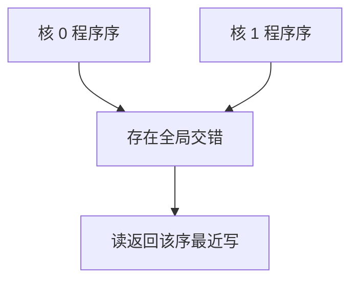

# 存储一致性模型

一致性保证同一地址上的副本跟上写；一致性模型规定不同地址上的读写，他核看来可以是哪种交错。

<footer>—— 据 Lamport, How to Make a Multiprocessor Computer That Correctly Executes Multiprocess Programs, IEEE TC 1979 整理</footer>

[上一课](/cs/snoop-vs-directory)让一行在多核间不会长期分叉。[乱序与 ROB](/cs/ooo-rob)允许核内 store 缓冲在提交前就执行。本课不重讲 M/E/S/I。缺口是：核 0 写 `x` 再写 `y`，核 1 能否先看见新 `y` 再看见旧 `x`？MESI 逐行处理，不回答。本课只钉顺序一致性作为规范，并指出放宽模型允许 store 缓冲对性能的意义。

## 问题

Lamport 的顺序一致性（SC）：存在一个所有操作的全序，与每个核自己的程序序一致，且每次读返回该序下最近的写。程序员可以把多核想成「一条指令一条指令地交错」。缺口不是新的 cache 状态，而是**核间可见性是否允许打乱每核的 store/load 序**。

硬件若坚持 SC，store 缓冲必须对别的核不可见直到排在前面的 store 全部全局可见，延迟上升。总存储序（TSO）允许把后到的 load 提前到未耗尽的 store 之前，x86 接近这一类。本课不枚举 ARM/RISC-V 的弱模型细则，只承认有放宽，并用 fence 恢复 SC 片段。

Coherence 是单变量；SC 是多变量上的交错。两者都要，不能互相替代。

## 方法

把每个核的访存看成程序序队列。SC 要求全局交错尊重这些队列。实现：提交 store 时按程序序注入 MESI 事务，load 不得越过更早的未完成 store（对 SC）。放宽后，lock 与发布-获取用栅栏指令把关键的两对变成 SC。

数据竞争：无序并发访问同一地址且至少一写，SC 下仍有定义，弱模型下往往无定义。本课只点名，不把 C++ 内存模型写完。

## 机制

MESI 提供单行的「当前值」；一致性模型提供多行之间的先后。store 缓冲、乱序 load、写原子性失败（一对对齐写被拆成两次可见）都会打破 SC。教学上先假设对齐字写是原子的。标志变量与数据之间的配对，正是多地址顺序要管的那一类。

栅栏对 CPI 是额外停顿：把缓冲抽干、禁止重排。阿姆达尔再次适用——只在同步点付费。

## 边界

本课不引入线性一致性作为分布式对象规范，不把 Lamport 时钟写进来。也不把 MESI 的总线序直接等同于 SC：窥探实现常常给出比 SC 更强的单行序，多行仍靠缓冲打破 SC。

后课默认：谈到共享内存正确性，先问模型是 SC 还是放宽。互连延迟会让「全局可见」更贵，那是 NUMA 课。

## 小结

- MESI 管单地址副本；SC 管多地址交错是否尊重程序序。
- 放宽模型换 store 缓冲性能，同步点用栅栏收回。
- 片上互连与远程内存延迟是下一课。
- 本课不把 C++ 内存模型或 Lamport 时钟写进来。
- 出处：Lamport, *IEEE TC*, 1979；Hennessy and Patterson, *CA:AQA*。
