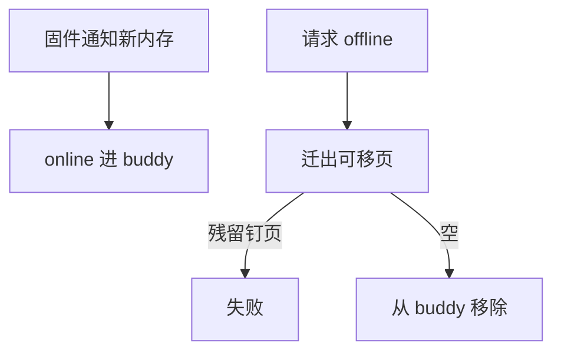

# 内存热插拔

热插拔把一段 pfn 标成 online/offline：下线前必须迁移走可移页，留下的是不可移内核页则失败。

<footer>—— 据 Linux memory hotplug 文档；ACPI 内存设备说明</footer>

[迁移](/cs/page-migration-compaction) 是原语。[uffd](/cs/userfaultfd) 改的是虚存内容来源。缺口是 **物理容量变化**：虚拟机 balloon 的亲戚在后课，这里先钉内核热插拔。

## 问题

`probe` 新内存：加 zone/section，online 后 buddy 可用。offline：isolate 该范围，migrate，从 buddy 摘掉。缺口：内核代码/不可移 slab 钉在范围内则 -EBUSY；MOVABLE zone 专为可下线而设；与 [NUMA](/cs/numa-mempolicy) 节点增减。本课不把每家固件通知写成 ACPI 手册。

稀疏内存模型用 section 粒度。CMA、kexec 与热插拔共享「可移性」概念。

## 方法

online：初始化 page 结构，交给 buddy。offline：`offline_pages` 循环迁移。对照 [md](/cs/md-raid) 热备：一个加盘，一个加 RAM。对照 DAX：PMEM 命名空间 online 是同类路径。

## 机制

热插拔让容量成为运行时变量，云与大型机依赖它。失败模式教会「内核数据放置」：不该把不可移对象放进可下线 zone。不要写成硬件采购。与 memcg：上限按页，容量减少会全局更紧。

和 inflight DMA：必须先停设备或 bounce。

实现上：section 粒度意味着不能下线任意一页。内核 .data 若落在可下线区，offline 永远失败，所以 ZONE_MOVABLE 存在。ACPI 通知与手动 probe 是两条上线路径。 读法上只引用[上一课](/cs/userfaultfd)的结论，不把对象换成训练推理或限价簿。

本课在操作系统进阶的「内存进阶 / 回收、迁移与加固」课序里，对象是 **内存热插拔**。

- 先修只引用，不重导：上一课的结论当公理，本课只补差。
- 五栏不吞并：不把本课写成大模型训练/推理，也不写成限价簿或权重量化。
- 文献用 OSTEP、McKusick、内核文档与具名会议论文；不发明 arXiv 编号。

## 边界

本课不引入 CXL 热插的全部。不保证 32 位系统可用。下一课内核自己的非连续虚映射：vmalloc。

版本字段会变，课序钉的是机制对象「内存热插拔」，不是某一主线内核的结构体名。
后课默认：pfn 范围可 online/offline，依赖迁移。内核 vmalloc 区如何拼页，下一课。

## 小结

- 热插拔 online/offline pfn；钉页会挡住线。
- MOVABLE 提高可下线性。
- vmalloc 是下一课。
- 出处：Linux memory hotplug；ACPI；Gorman。
