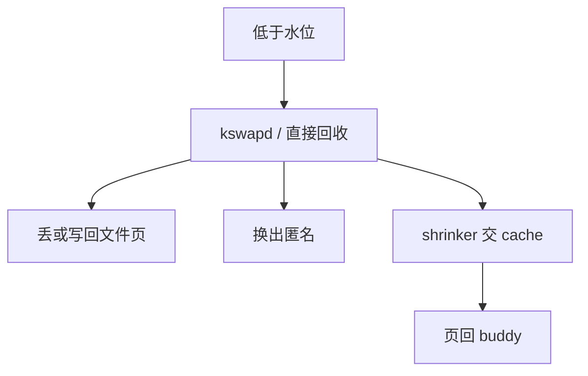

# 内存回收

空闲页不够时，内核主动收缩页 Cache、slab 与匿名驻留，而不是等到下一次缺页才 CLOCK 一页。

<footer>—— 据 Denning 的负荷控制；Bovet、Love 对 kswapd 与 shrinker 的整理</footer>

[上一课](/cs/slab-allocator)会囤页。[文件页](/cs/anon-vs-file-page) 与匿名页都占帧。[抖动](/cs/thrashing) 已说要减负荷。缺口是后台**回收**：水位（watermark）、kswapd、以及可注册的 shrinker，把可丢的页还给 buddy，供缺页与大页使用。

## 问题

纯反应式置换：每次缺页才选牺牲，延迟打在用户指令上。内核分配（网络、VFS）失败更糟。缺口：维护低/高水位；低于低水位唤醒守护线程，扫描 LRU/CLOCK、写回脏文件页、换出匿名、调用各子系统 shrinker（dentry、inode、slab）。直接回收（direct reclaim）发生在分配路径上，可能阻塞。本课不把每条 LRU 链表名字背完。

shrinker 是回调：VFS 缓存「我可以丢多少 dentry」。回收器按压力要它们交页。与 GC 不同：这里回收的是帧，对象语义由各 cache 自己保证。

## 方法

分配失败或周期性：计算需要多少页。优先丢干净文件页（再读文件）；再写回；再换出匿名；再收缩 slab。达到高水位停止。压缩（compaction）把已用页挪到一边，拼出 buddy 高阶块给大页。OOM 仅当这些都不够。与过度提交对照：回收增加「现在能拿出的帧」，不减少已承诺的 VMA。

## 机制

回收把 CLOCK、工作集、文件/匿名分类收成一条控制环：目标是 buddy 的低阶与高阶都有货。它解释了为何机器「内存看起来满」仍流畅——满的是 Cache，不是不可丢的匿名。文件系统课即将把「文件」当成正题；本课只要求 Cache 可收缩。不要把回收写成数据库查询计划。

## 边界

本课不引入 PSI（压力停滞信息）的全部用户接口。不保证实时任务不被直接回收卡住——实时路径应预留或 memlock。下一课离开虚存单元：用户如何用路径与描述符看字节，而不是看帧。

后课默认：帧可以从 Cache 挤回。文件作为用户看见的字节流，下一课从零命名。

## 小结

- 水位驱动 kswapd 与 shrinker，主动还页给 buddy。
- 先可丢文件页，再匿名换出；OOM 仍是最后手段。
- 文件字节流抽象是下一单元的第一课。
- 出处：Denning；Bovet and Cesati, *ULK*；Love, *LKD*。
