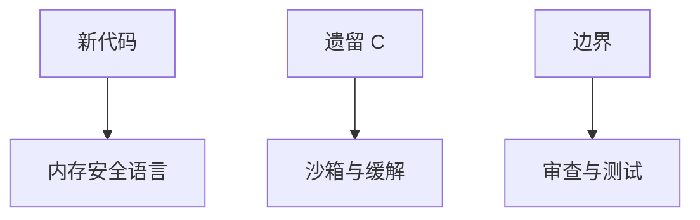

# 内存安全语言迁移

缓解堆叠提高利用代价；内存安全语言把越界、UAF、数据竞争从语义里删掉。迁移是 TCB 决策：新代码默认安全语言，遗留 C 用边界与沙箱围住。

<footer>—— 据 Miller 对内存安全的论述；Rust 所有权；seL4 对 C 子集验证的对照；Anderson 对 TCB</footer>

## 定位

上一课[PAC](/cs/pointer-authentication)仍假设 C 能写出任意写。缺口是**换语义**：Rust/Go/Java/.NET 等在各自模型里取消空间安全洞（不安全块与运行时漏洞除外）。本课讲迁移策略，不写语言教程。

后课默认已经读完本课钉下的合同，只补差，不从该领域第一性原理重开。

## 问题

C 的对象模型允许本单元全部洞。安全语言：界检查、GC 或借用、类型。缺口是 FFI 与 `unsafe`：洞从边界再进来。策略：新组件默认安全语言，C 缩进 TCB。

### 运行时仍要补丁

GC 实现、JIT、标准库仍是 C/C++ 时，沙箱与更新策略不能停。

Chrome/Android 等公开的语言迁移叙述。seL4 用验证过的 C 子集，是另一条路，本课程最后一课再收。

## 方法

分绿场与棕场：新服务用安全语言；解析器等攻击面优先重写；FFI 最小化。对照硬件缓解：迁移期仍开。下一课序改「如何发现」：fuzz。

图中节点是本课的机制骨架；课程不把图展开成可运行的攻击步骤。

## 机制

利用课序封口：从栈到硬件到语言。发现与工程课序从覆盖引导 fuzz 起，承认遗留 C 仍在。

前提写进合同之后，游戏外的误用只当失败模式点名，不在本课写成操作程序。

## 边界

本课不比较全部语言性能神话。下一课覆盖引导 fuzzing。

## 小结

- PAC/CET 是缓解；安全语言改语义。
- FFI 与运行时仍是 TCB。
- 迁移是攻击面排序，不是一天重写内核。
- 下一课序：覆盖引导 fuzz。
- 出处：Miller 等对内存安全；Rustonomicon 的 unsafe 边界；Anderson；Klein et al. seL4（对照）。
