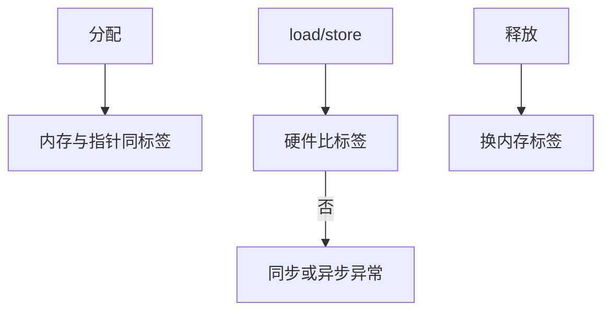

# 内存标签 MTE

MTE 给指针和内存块各存一小组标签，访问时硬件比较，对不上则故障，从而在运行时抓住空间错误。

<footer>—— 据 ARM 对 Memory Tagging Extension 的说明；Linux 对 MTE 的文档</footer>

[上一课](/cs/dma-coherence)留下的缺口接到本课。 [加固](/cs/kernel-hardening) 的金丝雀只护栈边界。[ASan](/cs/asan-mechanism) 后课用影子内存，税更高。缺口是 **硬件标签**：ARM MTE 在 OS 如何启用、与分配器接头。不是 SPARC ADI 的百科，但同族。

## 问题

堆溢出、UAF：指针仍指向可写框。MTE：16 字节粒度标签，指针上位或专用字段带 tag，逻辑与物理标签比较。缺口：内核 `kasan` 硬件模式、用户 `PR_SET_TAGGED_ADDR`、与 [malloc](/cs/malloc-implementation) 必须在释放时换标签。本课不把 Intel LAM 的全部等价物写完。

同步 vs 异步检查影响延迟与精度。标签位数有限，碰撞可能漏。不是形式证明。

## 方法

mmap 匿名区可标 MTE。分配器：取页，随机 tag，指针染色。free：改内存 tag，悬垂指针不再匹配。对照 [userfaultfd](/cs/userfaultfd)：一个填内容，一个查标签。对照 KPTI：一个隔离内核映射，一个隔离对象代。

## 机制

MTE 把空间安全从纯软件插桩变成 CPU 检查，税低于完整 ASan，覆盖粒度粗于 byte-ASan。OS 负责：页表属性、信号、coredump 里的 tag 状态。不要写成类型系统课。与 DMA：设备一般不带 tag，设备路径要绕或用未染色地址。

部署：用户态可逐步开；内核 KASAN 硬件模式服务开发内核。

实现上：标签 4 位则 16 分之一碰撞漏检。异步模式把故障推迟，难归因。内核与用户标签空间要配置，指针切片（PAC）是另一套硬件，不要混。 读法上只引用[上一课](/cs/dma-coherence)的结论，不把对象换成训练推理或限价簿。

本课在操作系统进阶的「内存进阶 / 回收、迁移与加固」课序里，对象是 **内存标签 MTE**。

- 先修只引用，不重导：上一课的结论当公理，本课只补差。
- 五栏不吞并：不把本课写成大模型训练/推理，也不写成限价簿或权重量化。
- 文献用 OSTEP、McKusick、内核文档与具名会议论文；不发明 arXiv 编号。

## 边界

本课不引入每种 libc 的 MTE 默认。不保证虚拟机把 MTE 传给客户。下一课用户态堆：malloc 实现。

版本字段会变，课序钉的是机制对象「内存标签 MTE」，不是某一主线内核的结构体名。
后课默认：硬件可对指针染色查越界/UAF。malloc 如何切 arena 与空闲链，下一课。

## 小结

- MTE 用标签匹配检测空间错误。
- 分配器释放必须换标签。
- malloc 实现是下一课。
- 出处：ARM MTE；Linux tagged address；KASAN 文档。
