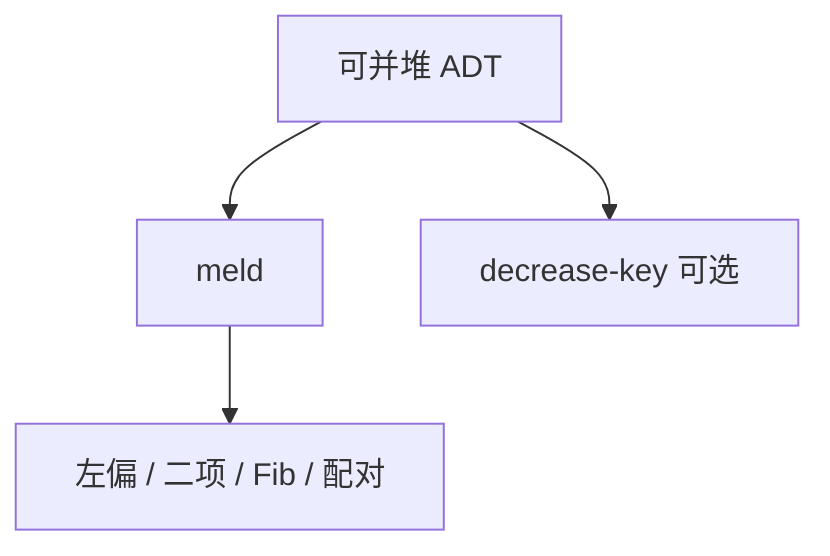

# 可并堆

优先队列加上 `meld`：两堆合成一堆，原堆作废；复杂度写在合同上，表示可以是左偏、二项或斐波那契。

<footer>—— 据 Cormen, Leiserson, Rivest and Stein；Okasaki, Purely Functional Data Structures；Tarjan 摊还文献整理</footer>

[左偏与配对](/cs/leftist-pairing-heap)、[斐波那契堆](/cs/fibonacci-heap)、[二项堆](/cs/binomial-heap) 已各给一种表示。调用方若绑死「必须完全二叉树数组」，`meld` 无法快。本课不重推 $B_k$。缺口是 ADT：可并堆的操作集与代价表，以及何时不要用可并堆。

## 问题

标准二叉堆：[数组](/cs/array-random-access) 下标父子，$\mathrm{insert}/\mathrm{extract\text{-}min}$ 最坏 $O(\log n)$，`meld` 要把一边插入另一边。可并堆合同至少含：`make`、`insert`、`find-min`、`extract-min`、`meld`；常加 `decrease-key`（需句柄）。缺口不是再发明第四种树，而是**按使用模式选表示**：只 meld 用左偏/二项；大量减键用 Fib（理论）或配对（实践）；不要在不可移动句柄的数组堆上假装 $O(\log n)$ meld。

Okasaki 给函数式可并堆（配对、斜堆）另一套摊还。本课偏命令式合同，函数式队列在后课。

## 方法

对照表（教学用，常数省略）：

- 二叉堆：meld 慢，减键 $O(\log n)$，局部性最好。
- 左偏：meld $O(\log n)$ 最坏，实现中等。
- 二项：meld $O(\log n)$，形状清晰。
- Fib：减键摊还 $O(1)$，extract-min $O(\log n)$ 摊还。
- 配对：meld/减键实践快，界依赖文献版本。

句柄：decrease-key 必须能找到节点。数组堆用下标；树用指针。meld 之后旧句柄属于新堆。

## 机制

算法课里 Kruskal 用并查集不靠可并堆；Dijkstra/Prim 的减键版本才关心堆合同。本课不重写那些算法，只要求选堆时看操作频率。函数式持久 meld 用路径复制，与命令式破坏性 meld 不同——后课持久化再分。

## 边界

本课不引入软堆、或并行 meld 的 PRAM 结果。双端（同时要 max 与 min）不是 meld 的推论，下一课专门给双端优先队列。

后课默认：需要 meld 就换可并表示。既要最小也要最大，用双端堆。

## 小结

- 可并堆 = 优先队列 + meld；表示按操作选。
- 减键要句柄；数组二叉堆不适合快 meld。
- 双端优先队列是下一结构。
- 出处：Cormen et al.；Okasaki；Tarjan。
