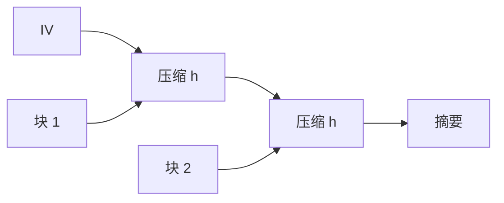

# Merkle–Damgård

把固定长压缩函数迭代起来，吃掉任意长消息：Merkle–Damgård 给 MD5、SHA-1、SHA-2 这族骨架。碰撞安全可从压缩函数归约，但也带上长度扩展这份遗产。

<footer>—— Merkle, 1979；Damgård, A Design Principle for Hash Functions, CRYPTO 1989</footer>

## 定位

上一课[填充预言](/cs/padding-oracle)关掉解密错误通道。密码学哈希在主干[哈希与碰撞](/cs/hash-collision)已有三条性质。缺口是**构造**：压缩函数如何接成长消息哈希，以及填充规则为何变成后课 HMAC 的理由。

后课默认已经读完本课钉下的合同，只补差，不从该领域第一性原理重开。

## 问题

压缩函数 $h:\{0,1\}^{n+b}\to\{0,1\}^n$ 只吃一块。MD：把消息分块，链上链接值 $IV$，最后一块含长度。若 $h$ 抗碰撞，则迭代后的 $H$ 也抗碰撞（在填充得当时）。缺口是这条归约，以及链上状态泄漏带来的长度扩展——不是再定义原像。

### MD5/SHA-1 已不当碰撞哈希

骨架仍值得学，因为 SHA-2 还在用它。碰撞已被找到的算法只当反例。

Damgård CRYPTO 1989。长度填充是归约的一部分：不同长度不能默默撞进同一链。本课不给碰撞搜索程序。

## 方法

画 IV → 压缩 → 压缩 → 输出。写长度填充的动机。指出 SHA-256 仍是 MD；SHA-3 不是。下一课海绵。

图中节点是本课的机制骨架；课程不把图展开成可运行的攻击步骤。

## 机制

签名与承诺吃的是 $H(m)$。MD 让 $H$ 可流式更新。链上链接值等于「内部状态」；若敌手知道 $H(m)$ 且 $H$ 是裸 MD，状态可被继续压缩——这是长度扩展，下一课用 HMAC 关。

前提写进合同之后，游戏外的误用只当失败模式点名，不在本课写成操作程序。

## 边界

本课不证全部填充变体，不把 Keccak 提前讲完。海绵结构下一课换掉「链上状态即摘要」这一条。

## 小结

- 主动加密预言之后，回到哈希骨架。
- MD：压缩函数迭代 + 长度填充。
- 碰撞归约成立，长度扩展是遗产。
- SHA-3 海绵是下一种结构。
- 出处：Merkle；Damgård, 1989；对照 NIST SHA-2。
