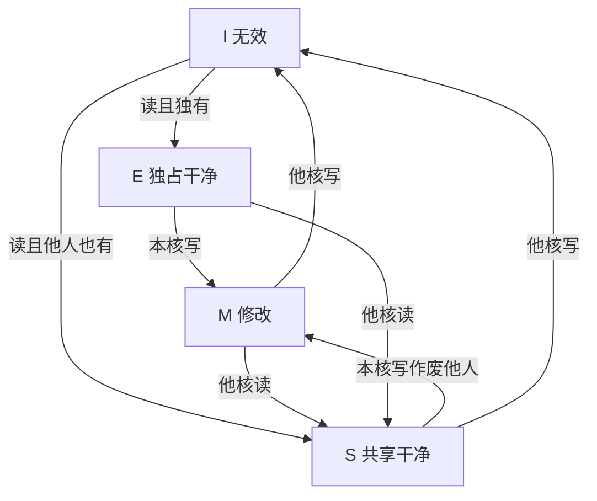

# MESI

一行在每个 cache 里只能处于修改、独占、共享、无效之一；写前先拿到独占，读共享则大家标签相同。

<footer>—— 据 Papamarcos and Patel, A Low-Overhead Coherence Solution for Multiprocessors with Private Cache Memories, ISCA 1984 整理</footer>

[上一课](/cs/multicore-shared-cache)让每个核握有私有 L1。[一致性问题引入](/cs/multicore-shared-cache)要的不变式还没有状态机。[写回与写分配](/cs/write-back-allocate)的脏位是单核的；多核要区分「脏且独有」和「干净可共享」。本课不重讲 LLC 拓扑。缺口是一份可实现的窥探协议：MESI。

## 问题

只靠「写则广播数据」带宽太大；只靠「写则作废」必须保证写者有最新副本。需要四个状态：Invalid 无有效副本；Shared 干净，他人也可有；Exclusive 干净且独有，可静默变脏；Modified 脏且独有。缺口不是新的 cache 容量，而是**状态转换与总线事务对应**，使得任意时刻至多一份 Modified，且 Shared 时无脏副本。

Papamarcos–Patel 的 Illinois 协议是 MESI 的经典表述。本课按教学简化，不穷尽每种竞态下的时序图。

MSI 没有 Exclusive：独有的干净行也要写时再占总线。MESI 用 E 省掉那一次。

## 方法

窥探：每核看见总线上的读/写请求。读缺失：若他核为 M，先写回再提供数据，双方变 S；若无脏，从 LLC/DRAM 填入，根据「是否独有」进 E 或 S。写缺失或 S 上写：发作废，等他核 I，自己变 M。替换 M 行必须写回。

## 机制

该机保证：读到的值是最近一次已提交写（在一致性意义上的「最近」——全局序由总线仲裁给出）。与 ROB 的配合：只有提交的 store 才发出作废或升级，未提交写留在核内。

假共享：同一行两个字分别被两核写，行在 M 与 I 之间振荡。粒度是行，不是变量。软件对齐可以缓解，协议本身不拆行。

## 边界

本课不引入 MOESI 的 Owned、不引入目录协议。大规模上窥探广播不可扩展，那是互连课的动机之一。也不把 MESI 当成存储模型：它管副本相同，不管两个地址的 store 以何种顺序被他核看见。

后课默认：私有 cache 行带 MESI 状态；写前求 M，共享读为 S。程序员仍要另问「我的两条 store 他核怎么看见」。

## 小结

- MESI 四态维持单地址副本不变式；写前独占。
- Exclusive 避免干净独有行写时占总线。
- 多地址上的顺序是下一课存储一致性。
- 出处：Papamarcos and Patel, *ISCA*, 1984；Hennessy and Patterson, *CA:AQA*。
