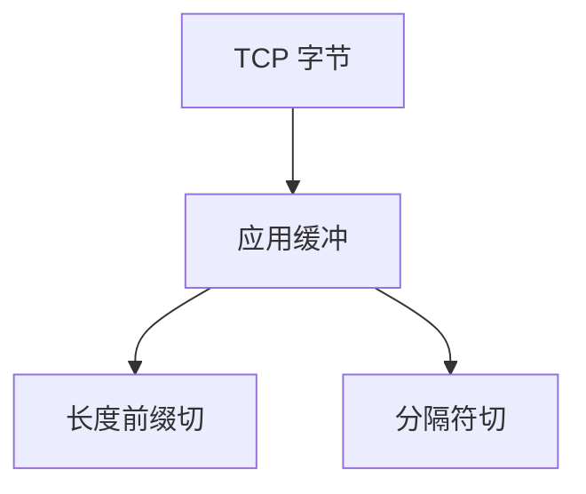

# 粘包与帧定界

TCP 是字节流，两次 `write` 可并成一次 `read`；应用必须自己定界：长度前缀、分隔符或自描述编码。

<footer>—— 据 RFC 9293 字节流；Stevens UNP；Protobuf/gRPC 帧对照整理</footer>

[序列化](/cs/serialization-protobuf) 产出消息。[Reactor](/cs/reactor-proactor) 一次可读任意字节。[上一课](/cs/c10k-concurrency) 不保证消息边界。缺口是**成帧**：粘包、拆包、缓冲。本课不把心跳写完。

## 问题

UDP 有报文边界（仍可能丢/乱序）。TCP 无。JSON 无长度时要括号配对，危险。常见：4 字节长度 + 体；WebSocket 已有帧；gRPC 有 5 字节前缀；HTTP/1.1 用 Content-Length/chunked。TSO 把大缓冲切开，接收 GRO 再粘，应用仍要定界。SSH 与 TLS 记录层自己成帧。

不要用 `sleep` 当定界。

UNP 强调。本课不发明私有协议细节。

### 字节流无消息

长度前缀或记录层定界。sleep 不是帧。最大长度要帽。SCTP/UDP 有边界是对照不是 TCP 的性质。

## 方法

对照三种定界。画：读循环 → 缓冲 → 切消息 → handler。与线路码逗号对齐同构，一层 PHY，一层应用。

方法止于选定对象与对照；机制才说它如何嵌入已有分层与主干课。

## 机制

部分读：非阻塞下必循环。最大长度要帽，防内存炸弹。QUIC 流有流内偏移，仍要应用帧若多消息。SCTP 消息边界是对照。PMTUD 不解决粘包。

安全：长度字段过大是 DoS。

## 边界

本课不引入 ASN.1 TLV 的全部。心跳与超时是下一课。后课默认：字节流必须应用成帧。

把「一条 write 一条 read」当定理，在负载下必碎。

上一课留下的缺口在本课收口；「粘包与帧定界」进入后课词汇表后只引用。文献用来钉对象与边界，不把本课写成该主题的独立综述。下一课[心跳与超时](/cs/heartbeat-timeout)。

## 小结

- TCP 粘/拆包是正常。
- 长度、分隔或记录层定界。
- 读循环 + 上限缓冲。
- 后课只引用本课钉死的对象，不从该领域总问题重开。
- 出处：RFC 9293；UNP。
