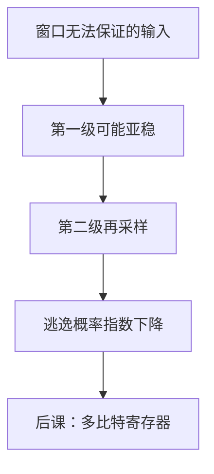

# 亚稳态与同步器

建立保持规定了合法窗口；窗口外采样时 Q 可能停在中间电压，停留时间没有上界，只能谈概率。

<footer>—— 据 Harris and Harris, Digital Design and Computer Architecture 整理</footer>

上一课[建立保持时间](/cs/setup-hold)写出了 $T$ 与保持的不等式。不等式满足时，当拍 Q 是合法比特。本课不重推那两条，也不从噪声谱另起。缺口是：异步输入、复位释放、跨时钟，**无法**静态保证窗口；必须承认亚稳，并用同步器把逃逸概率压下去。

## 问题

双稳态在中间是不稳定平衡。D 在边沿附近变，触发器可能长时间既非 0 也非 1，下游当 0 和当 1 的门会拆开。解析时间大致指数变好，$P(\mathrm{fail})\propto e^{-t/\tau}$。缺口是工程含义：多等一拍（再插一级 FF）让亚稳在中间级衰减，而不是「再等两拍数据就对」。

同步器：两级（或更多）同域 FF 串起来采样异步信号。MTBF 可算到很大，不是无穷。

### 同步器不是功能延时器

它不保证「第二拍一定是正确的那位电平」，只保证「第二拍仍非法的概率极低」。把 CDC 当「打两拍的 FIFO」，多比特会撕裂——[时钟域](/cs/clock-domain)再收；本课先钉单比特亚稳。

Harris 给出亚稳窗口与解析时间常数。本课不把 $\tau$ 拟合成工艺作业。寄存器堆、ALU 之间的同步路径应用上一课不等式，不走同步器。

## 方法

能静态时序的路径：满足 $t_{su}$/$t_h$，不要同步器。不能的：标识为异步，插入 $\ge 2$ 级 FF，禁止在第一级 Q 上做组合再送第二级以外的逻辑（组合会吃掉解析时间）。

## 机制

后课寄存器是并排 D，内部同步。与按钮、外设时钟、另一 PLL 的交叉才用本课。单周期教学 CPU 常假装外设已同步；组成主干记得：未同步输入可以直接破坏精确状态。

复位释放靠近边沿等于异步 D，释放也要同步。

## 边界

本课不讲 PLL 锁定检测、不把全异步握手流水线当默认。不讨论量子或模拟比较器亚稳的另一套公式。

后课默认：同域路径靠建立保持；异步边沿靠同步器降概率。多比特交叉下一课之后的时钟域课才用 FIFO/握手。

## 小结

- 窗口违规可导致亚稳，解析无上界、有概率。
- 两级同步器压低逃逸，不是功能必对。
- 同步设计内部仍用上一课不等式，不要滥用同步器。
- 出处：Harris and Harris。
