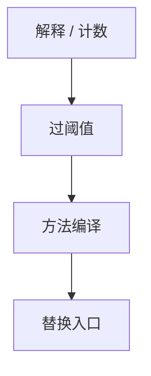

# 方法 JIT 与热点

计数调用或回边，过阈值则把整方法编译成 native，替换入口。冷方法留在解释器，摊还编译成本。

<footer>—— 据 Deutsch and Schiffman；Aycock, A Brief History of Just-In-Time；HotSpot 方法编译对照整理</footer>

上一课[线程化分派](/cs/threaded-dispatch) 仍逐条解释。缺口是 **JIT**：热点方法一次编译，多次执行。本课钉方法级、计数、替换，追踪 JIT 下一课。不写去优化。

## 问题

AOT 编译全部，启动慢、体积大。纯解释启动快、峰值慢。JIT：用轮廓（解释时计数）决定。缺口是**编译单位 = 方法**，不是 ELF 全程序。

入口：调用点从解释器桩改成 compiled 入口（或栈上 on-stack replacement 后课）。

### 热点不是 PGO 文件

PGO 是另一次运行的离线轮廓；JIT 轮廓是本次进程的。可结合：AOT 用 PGO，JVM 用在线。

Deutsch–Schiffman 已把 JIT 当 Smalltalk 路径。Aycock 综述。HotSpot。本课方法 JIT；TraceMonkey 下一课。

## 方法

每方法 invocation/backedge 计数。阈值到：编译队列（可后台线程）。安装：更新调用点、vtable。失败：保留解释器。

与[内联](/cs/inlining-heuristics)：JIT 内联用在线热度更准。与 LTO：JIT 看见的是已加载类，开世界仍在（新类）。

## 机制

编译线程与应用线程：队列、代码缓存上限、回收冷码。不要在持锁时同步编译导致卡顿——启发。

ISA：JIT 是[交叉](/cs/cross-compile-triple) 的特例，目标=本机。

## 边界

本课不写追踪。后课默认：热点方法可编译。下一课追踪 JIT：以路径为单位而非方法。

也不把 JIT 当恶意运行时注入教程。

## 小结

- 方法 JIT：计数 → 编译整方法 → 换入口。
- 摊还启动与峰值。
- 代码缓存与后台编译是工程。
- 出处：Deutsch and Schiffman；Aycock；HotSpot 文献。
