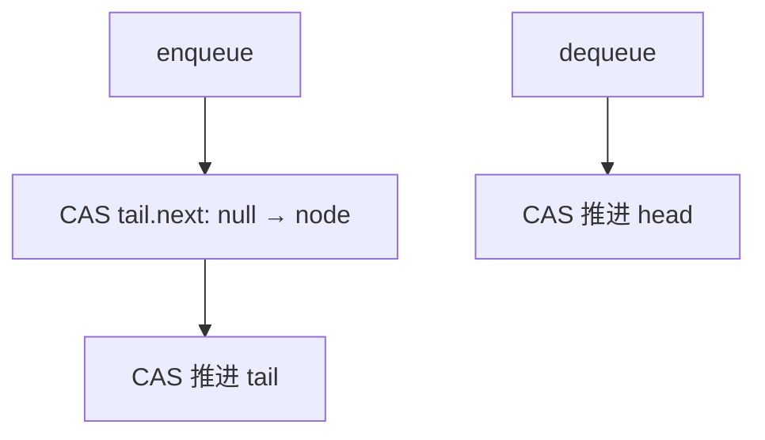

# Michael–Scott 无锁队列

哨兵节点永远在；enqueue CAS 尾的 next，再帮着推进 tail；dequeue CAS 头。线性化在成功的 CAS 上。

<footer>—— 据 Michael and Scott, Simple, Fast, and Practical Non-Blocking and Blocking Concurrent Queue Algorithms, PODC 1996；Herlihy and Shavit 整理</footer>

[上一课](/cs/lsm-tree-ds) 的并发在文件层。[函数式队列](/cs/functional-queue) 无共享写。[无锁与 ABA](/cs/lockfree-aba) 已钉 CAS 语义。[原子 RMW](/cs/atomic-rmw) 现成。本课不 compaction。缺口是 Michael–Scott 队列：实用无锁 FIFO。

## 问题

多生产者多消费者 FIFO。加锁队列简单但有锁。MS 队列：`head`、`tail` 指向节点链表，首节点是哨兵（dummy）。入队：在 `tail->next` 上 CAS 从空到新节点，成功后再 CAS `tail` 前移；若看见别人已接上 next，则帮推进 tail 再试。出队：读 `head->next` 为真头，CAS `head` 前进，旧哨兵可回收。缺口是**两步 CAS 与「帮忙」以保持无锁**。

Michael and Scott, *PODC*, 1996。ABA：节点回收后复用骗 CAS，需 hazard、epoch 或带 tag 指针——下一课。

## 方法

节点含 `next` 与值。空队列：`head==tail` 且 next 空。实现必须先写节点内容再 CAS 链入（发布）。失败重试是无锁允许的活锁风险，实践有界。

与环形数组 SPSC：单生产者可无 CAS 只屏障，更快；MS 面向 MPMC。与跳表：队列无序键，只 FIFO。

## 机制

线性化：入队成功挂 next 的 CAS；出队成功移 head 的 CAS。帮忙保证 tail 不落后太多，避免无锁失败。本课不给可复现的破坏性时序作业。

回收：出队后节点不能立刻 `free`，否则 ABA 与 UAF。下一课 hazard pointer。

## 边界

本课不写完整可移植 C++ 实现当唯一答案。阻塞队列（两锁）是论文另一半，点名。栈的无锁更易 ABA，与 hazard 一起下一课。

后课默认：MPMC 无锁 FIFO 用 MS 队列。回收与栈用 hazard pointer。

## 小结

- MS 队列：哨兵链表，CAS next 与 head/tail。
- 无锁靠帮忙推进 tail；注意发布序。
- 回收与 ABA 交给 hazard。
- 出处：Michael and Scott, *PODC*, 1996。
