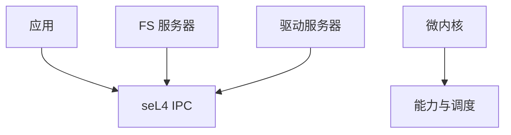

# 微内核 L4 / seL4

微内核只把地址空间、线程、IPC 留在核内；驱动与文件系统在用户态。seL4 进一步给出形式化功能正确与隔离证明。

<footer>—— 据 Liedtke 对 L4 的论述；Klein et al., seL4, SOSP 2009；[证明助手](/cs/proof-assistants) 为形式化先修对照</footer>

[unikernel](/cs/unikernel) 把一切链进一空间。[Linux](/cs/user-kernel-split) 是宏内核。缺口是 **微内核**：IPC 税与 seL4 证明范围。

## 问题

驱动崩不倒核，但每条 I/O 可能 IPC。seL4：抽象规格证明，假设硬件模型。缺口：Linux 兼容要用户态 Linux 或 personality；实时可强。本课不把证明脚本当作业。

L4 家族性能靠寄存器传短消息。对象是内核最小化，不是 Linux 发行版。

## 方法

用户 pager 实现分页；文件系统是服务器。对照 FUSE：Linux 上的用户 FS 是亲戚。对照 [gVisor](/cs/gvisor)：都把服务挪出核，机制不同。对照 KVM：微内核可当 hypervisor（OKL4 等）。

## 机制

微内核把可信计算基缩小到 IPC/调度/页，用形式化（seL4）连接课程序列开头的证明助手。它不自动给你 Linux 生态。不要写成宗教。与 [capabilities](/cs/linux-capabilities)：seL4 能力是真正权能系统，比 Linux cap 更细。

性能：IPC 快路径是一切。

实现上：证明覆盖功能正确与完整性，假设硬件转换与汇编桩。Linux 应用要跑在用户态 Linux 或兼容层。IPC 快路径用寄存器传短消息，长消息映射页。 读法上只引用[上一课](/cs/unikernel)的结论，不把对象换成训练推理或限价簿。

本课在操作系统进阶的「虚拟化与隔离进阶 / 容器与内核形态」课序里，对象是 **微内核 L4 / seL4**。

- 先修只引用，不重导：上一课的结论当公理，本课只补差。
- 五栏不吞并：不把本课写成大模型训练/推理，也不写成限价簿或权重量化。
- 文献用 OSTEP、McKusick、内核文档与具名会议论文；不发明 arXiv 编号。

## 边界

本课不引入所有验证假设（TLB、缓存）。不保证多核证明的全部定理。下一课外核：把抽象再往下推。

版本字段会变，课序钉的是机制对象「微内核 L4 / seL4」，不是某一主线内核的结构体名。
后课默认：内核可小到 IPC+页，并可被证明。外核与库 OS 把抽象交给应用，下一课。

## 小结

- L4：核内仅 IPC/线程/空间；seL4 有证明。
- 驱动在用户；兼容 Linux 要另做。
- 外核/库 OS 是下一课。
- 出处：Liedtke L4；Klein et al., seL4 SOSP 2009。
