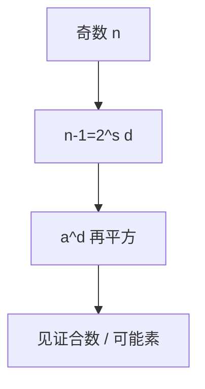

# Miller–Rabin 素性测试

把 $n-1=2^s d$ 写成奇 $d$，检查随机底 $a$ 的平方链是否给出非平凡平方根 $1$；合数至少被 $3/4$ 的底揭穿，重复则错误指数下降。

<footer>—— 据 Miller, 1976；Rabin, 1980；Knuth, TAOCP 卷 2 整理</footer>

上一课[二次剩余](/cs/quadratic-residue) 用过 $a^{(p-1)/2}$。费马测试被 Carmichael 欺骗。缺口是 **Miller–Rabin**：强伪素见证。主干随机算法课点名素性，未写数论。本课 Monte Carlo：是素数永不误判为合？否——方向：合数可能被当成素（单侧），重复压错误。AKS 在 P，实践仍用 MR。

## 问题

$n$ 奇。写 $n-1=2^sd$。若 $n$ 素，则 $a^d\equiv 1$ 或某 $a^{2^rd}\equiv -1\pmod n$（在到达 $1$ 之前）。否则 $a$ 是合数见证。Rabin：至多 $1/4$ 的 $a$ 对合数说谎。$k$ 次独立，$4^{-k}$。确定性 Miller 在广义 Riemann 假设下把底限制到 $O((\log n)^2)$，本课点名。

Carmichael 数通过费马，多数过不了 MR 的平方链。

### 不是分解算法

输出「可能是素 / 合数见证」。合数见证不给出因子。分解是另一问题。

Miller 1976（GRH 下确定）；Rabin 1980 随机。Knuth 卷 2。Damgård–Landrock–Pomerance 的错误界更细，课堂用 $1/4$。

## 方法

对小合数 $n=91$ 找一个见证。写清算法步骤。对照[BPP](/cs/bpp-randomized-class)：MR 是 RP 形状（合数有许多见证）。素数生成下一课：随机抽奇数再 MR。

## 机制

有了单侧错误的素性测试，密码才能在多项式时间内抽样「看起来像素数」的整数。错误 $4^{-k}$ 可小于硬件故障率。确定性 AKS 多项式次数高，不替代本课。

不要用费马测试当生产实现。

确定性界：对 $n<2^{64}$ 用固定底集合即可（实现表），课堂仍讲随机。强伪素数相对某底通过 MR，必须换底。AKS 是多项式确定，次数高。ECPP 给证明证书，验证快于再跑 MR。生产密钥生成走下一课的抽样 + 本课检验。

## 边界

本课不证 $1/4$ 界，不写 AKS。不引入椭圆曲线素性证明（ECPP）全文。后课默认：实践素性 = 重复 Miller–Rabin。下一课素数分布与生成。

单侧错误：素数永不被判合；合数以 $\le 1/4$ 概率骗过一轮。重复独立即可压到可忽略。它不输出因子。生成密钥是抽样问题，下一课用素数定理估次数。

上一课留下的缺口在本课收口；「Miller–Rabin 素性测试」进入后课词汇表后只引用。文献用来钉对象与边界，不把本课写成该主题的独立综述。

## 小结

- MR：平方链查非平凡根 $1$；合数 $\le 1/4$ 底说谎。
- 单侧 Monte Carlo；重复指数压错误。
- 不分解；强于费马测试。
- 出处：Miller, 1976；Rabin, 1980；Knuth。
