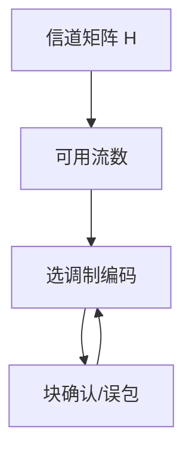

# MIMO 与速率自适应

多天线把空间当新的自由度：流数受秩限制；速率自适应则按瞬时 SNR 选 MCS，使工作点跟着衰落走。

<footer>—— 据 Telatar, Capacity of Multi-antenna Channels, ETT 1999；IEEE 802.11n/ac 整理</footer>

[上一课](/cs/wifi-frames-ofdm)给出 OFDM 与 MCS 阶梯。缺口是**空间复用与怎么爬阶梯**：MIMO 把 $C$ 近似写成 $\sum\log(1+\lambda_i\mathrm{SNR})$；自适应用探测与统计选调制编码。本课不把 Wi‑Fi 6 的 RU 调度写完。

## 问题

单天线 OFDM 已用尽该 $B$ 下的频率自由度。多天线：信道矩阵 $H$ 的奇异值给出并行流。11n 起数据口走空时编码或 SDM。自适应：若固定 64-QAM，深衰落就爆错；降到 QPSK 保住连通。探帧、块确认统计、或闭环 CSI（11ac/ax 更重）驱动降阶/升阶。有线自协商几乎一次定终身；无线每毫秒都可能改 MCS。

不要把天线数写成容量线性倍数：相关与秩不足时流数上不去。

Telatar 与 Foschini 给出高斯 MIMO 容量。802.11 实现是离散 MCS 表。本课不推注水功率分配全文。

### 天线数不是容量倍数

秩不足则流数上不去。有线自协商几乎一次定终身；无线 MCS 持续跟踪。碰撞会被误读成差信道。

## 方法

对照：开环（STBC 稳）vs 闭环（波束、预编码）。画：估计 $H$ → 选流数与 MCS → 发 → 看 PER → 调。有线 PAM-4 降阶是同类，只是时间尺度不同。

方法止于选定对象与对照；机制才说它如何嵌入已有分层与主干课。

## 机制

AP 与客户端能力取交，类似自协商，但之后仍自适应。LACP 哈希与 MIMO 流无关：流在 PHY，哈希在桥。PFC 很少用在无线跳上。容量仍是上界；MCS 是带 PER 约束的离散点。

隐终端与自适应叠加：碰撞被当成「信道差」会误降速，协议用 RTS/CTS 或调度减轻。

## 边界

本课不引入 MU-MIMO 用户选择算法的全部。Wi‑Fi 6 OFDMA 是下一课。后课默认：MIMO 给空间自由度；自适应跟踪衰落。

不要把「8×8」广告当室内总能 8 流。

上一课留下的缺口在本课收口；「MIMO 与速率自适应」进入后课词汇表后只引用。文献用来钉对象与边界，不把本课写成该主题的独立综述。下一课[WiFi 6 / 7 与 OFDMA](/cs/wifi6-ofdma)。

## 小结

- MIMO 容量由信道秩与奇异值决定。
- MCS 自适应是离散逼近瞬时 $C$。
- 碰撞会污染速率估计。
- 后课只引用本课钉死的对象，不从该领域总问题重开。
- 出处：Telatar, 1999；IEEE 802.11n/ac。
