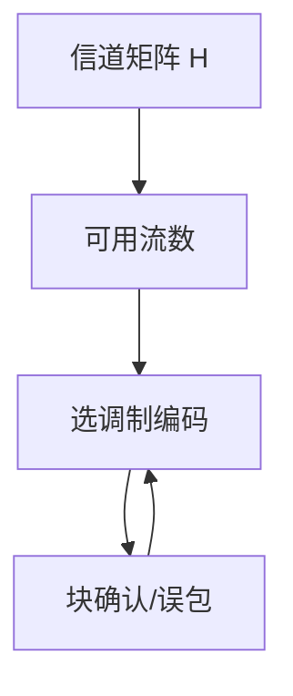
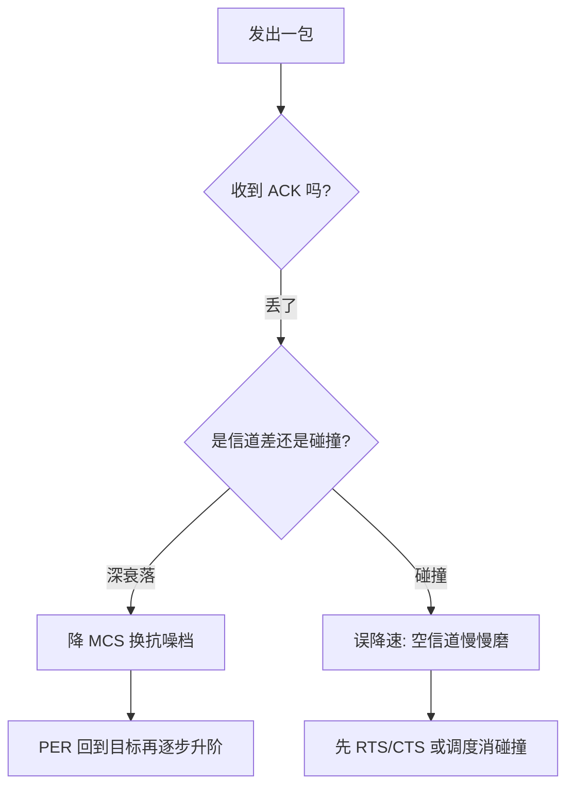

# MIMO 与速率自适应

多天线把空间当新的自由度：流数受秩限制；速率自适应则按瞬时 SNR 选 MCS，使工作点跟着衰落走。

<footer>—— 据 Telatar, Capacity of Multi-antenna Channels, ETT 1999；IEEE 802.11n/ac 整理</footer>

[上一课](/cs/wifi-frames-ofdm)给出 OFDM 与 MCS 阶梯。缺口是**空间复用与怎么爬阶梯**：MIMO 把 $C$ 近似写成 $\sum\log(1+\lambda_i\mathrm{SNR})$；自适应用探测与统计选调制编码。本课不把 Wi‑Fi 6 的 RU 调度写完。

## 问题

单天线 OFDM 已用尽该 $B$ 下的频率自由度。多天线：信道矩阵 $H$ 的奇异值给出并行流。11n 起数据口走空时编码或 SDM。自适应：若固定 64-QAM，深衰落就爆错；降到 QPSK 保住连通。探帧、块确认统计、或闭环 CSI（11ac/ax 更重）驱动降阶/升阶。有线自协商几乎一次定终身；无线每毫秒都可能改 MCS。

术语翻译：MCS（调制与编码方案）就是「每个符号塞多少比特 + 配多强纠错」的档位组合——像变速自行车的变速器：信号好挂高速档（64-QAM，塞得多），信号差挂低速档（QPSK，塞得少但抗噪）；速率自适应就是自动换挡。

不要把天线数写成容量线性倍数：相关与秩不足时流数上不去。

Telatar 与 Foschini 给出高斯 MIMO 容量。802.11 实现是离散 MCS 表。本课不推注水功率分配全文。

### 天线数不是容量倍数

秩不足则流数上不去。有线自协商几乎一次定终身；无线 MCS 持续跟踪。碰撞会被误读成差信道。

## 方法

对照：开环（STBC 稳）vs 闭环（波束、预编码）。画：估计 $H$ → 选流数与 MCS → 发 → 看 PER → 调。有线 PAM-4 降阶是同类，只是时间尺度不同。

```mermaid
flowchart TD
  H["信道矩阵 H"] --> RANK["可用流数"]
  RANK --> MCS["选调制编码"]
  MCS --> PER["块确认/误包"]
  PER --> MCS
```

## 机制

AP 与客户端能力取交，类似自协商，但之后仍自适应。LACP 哈希与 MIMO 流无关：流在 PHY，哈希在桥。PFC 很少用在无线跳上。容量仍是上界；MCS 是带 PER 约束的离散点。

数字实例：容量公式 $C=\sum_i \log_2(1+\lambda_i\,\mathrm{SNR})$ 是对数增长：单流 SNR $=15$ 时 $C=\log_2 16=4$ bit/s/Hz，把功率翻倍到 $31$ 也只到 $\log_2 32=5$——功率线性往上堆，速率只按 log 蠕动，这正是降阶「以小带宽损失换大可靠性」的数学背景。

隐终端与自适应叠加：碰撞被当成「信道差」会误降速，协议用 RTS/CTS 或调度减轻。

常见误区：以为丢包都是信号差。碰撞（邻居同时在发）同样让 ACK 不来；速率自适应若把它当深衰落而降档，信道明明空着却用低速慢磨。所以要有 RTS/CTS 或调度，把「碰撞」从「信道差」里摘出来再换挡。

```mermaid
flowchart TD
  TX["发出一包"] --> LOSS{"收到 ACK 吗?"}
  LOSS -->|"丢了"| WHY{"是信道差还是碰撞?"}
  WHY -->|"深衰落"| DOWN["降 MCS 换抗噪档"]
  WHY -->|"碰撞"| MISTAKE["误降速: 空信道慢慢磨"]
  MISTAKE --> FIX["先 RTS/CTS 或调度消碰撞"]
  DOWN --> OK["PER 回到目标再逐步升阶"]
```

## 边界

本课不引入 MU-MIMO 用户选择算法的全部。Wi‑Fi 6 OFDMA 是下一课。后课默认：MIMO 给空间自由度；自适应跟踪衰落。

不要把「8×8」广告当室内总能 8 流。

下一课[WiFi 6 / 7 与 OFDMA](/cs/wifi6-ofdma)。

## 小结

- MIMO 容量由信道秩与奇异值决定。
- MCS 自适应是离散逼近瞬时 $C$。
- 碰撞会污染速率估计。
- 后课只引用本课钉死的对象，不从该领域总问题重开。
- 出处：Telatar, 1999；IEEE 802.11n/ac。
