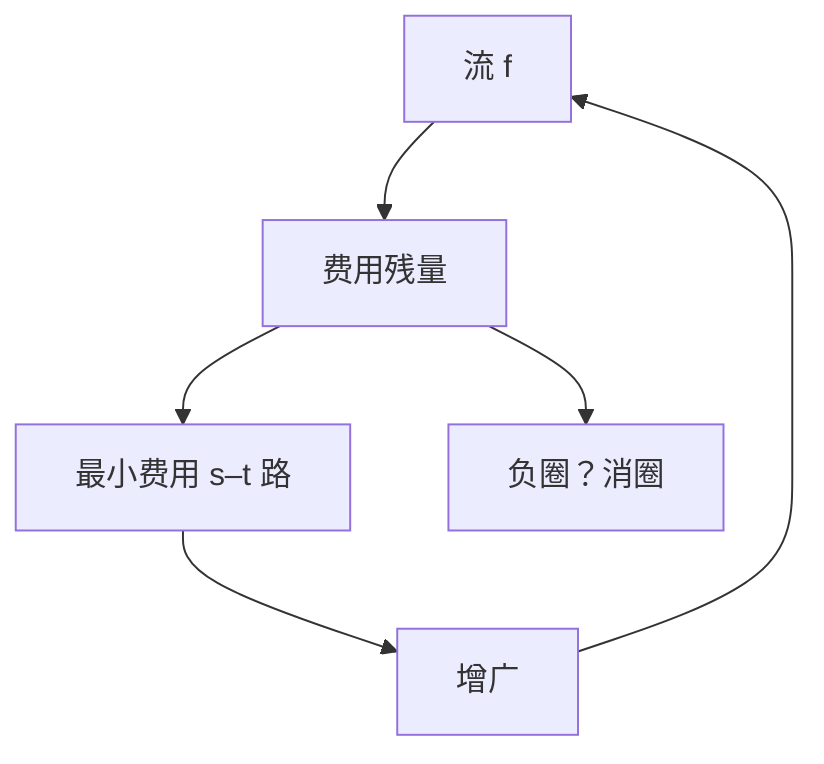

# 最小费用最大流

每条边既有容量又有费用；最大流中费用最小者，可由残量上对费用做最短路反复增广，或用消圈。

<footer>—— 据 Klein, A Primal Method for Minimal Cost Flows, 1967；Edmonds and Karp, 1972；CLRS 第 26、29 章整理</footer>

上一课[Borůvka 与次小生成树](/cs/boruvka-second-mst)收束无向 MST。主干[最大流](/cs/max-flow-ff)只有容量。缺口是**费用**：单位流经过边 $e$ 付 $w(e)$，求最大流中总费用最小（或指定流量 $F$ 的最小费用）。不重证最大流最小割。后课用最小割做建模，费用流当运输工具。

## 问题

流满足容量与守恒；费用 $\sum_e w(e)f(e)$。残量：正向费用 $w$，反向 $-w$（退流退款）。连续最短路（SSP）：在残量上对 $w$ 求 $s$–$t$ 最短路（无负环时 Bellman–Ford 或势函数 + Dijkstra），沿路增广，直到流量够或无可增广。有负环则先消费用负圈（Klein）：残量负圈对应可改进费用而不改 $|f|$。

缺口是「费用残量」，不是新的守恒定律。整数容量、有限最优时终止。

### 势函数消去负边

$w$ 可负（退流）。Johnson 势 $h$：$\hat w(u,v)=w(u,v)+h(u)-h(v)\ge 0$ 后 Dijkstra。[Johnson 全源](/cs/johnson-apsp)已用过这套；本课每次增广后更新势。不要对含负圈的残量跑 Dijkstra。

Klein 1967 消圈。Edmonds–Karp 也讨论最小费用。连续最短路是教材默认。容量缩放、消圈的多项式实现（Goldberg–Tarjan）点名不写。后课最小割建模常不需要费用。

## 方法

建残量。若可能有负圈，先消圈或用 Bellman–Ford 判。循环：最短路增广。记录流量与费用。二分图带权匹配可化成费用流（下一课的下一课 KM 是组合特例）。

无源汇循环流的最小费用是纯消圈。

## 机制

最优性：可行流费用最小当且仅当残量无负费用圈。SSP 每步沿最小费用路加，保持「当前流量下费用最优」的不变式（需证明增广不破坏）。与普通最大流：忽略 $w$ 则回到 Ford–Fulkerson，费用可能很差。

运输、指派、带下界的流，都先化成这份网络。不要用 MST 的边权当流费用的算法。

## 边界

本课不写全部多项式算法的紧界，不写环流分解细节全文。负无穷容量或无界费用要先检查。后课默认：最小费用流 = 残量最短路增广或消圈。下一课把最大流最小割当成建模语言。

## 小结

- 费用残量：正向 $w$、反向 $-w$；无负圈则最优。
- 连续最短路增广；负边用势 + Dijkstra。
- 指派等问题先化网络。
- 出处：Klein, 1967；Edmonds and Karp, 1972；CLRS。
