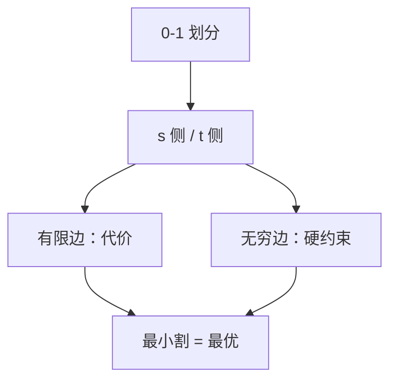

# 最小割的建模

把「选或不选」写成 $s$ 侧与 $t$ 侧；项之间的代价写成跨边容量，最小割给出最优划分。

<footer>—— 据 Ford and Fulkerson, 1956；项目选择见 Picard, Maximal Closure of a Graph, 1976；CLRS 第 26 章整理</footer>

上一课[最小费用最大流](/cs/min-cost-flow)给了带费用的流。许多组合划分其实**不需要费用**，只要 $s$–$t$ 最小割。主干已证最大流 $=$ 最小割。本课不重证。缺口是**怎么建图**：项目选择、图的闭包、二元势函数的子模特例。后课回到匹配的组合算法。

## 问题

顶点要分到 $S\ni s$ 或 $T\ni t$。跨割边容量之和是代价。建模：想惩罚「$u$ 在 $S$、$v$ 在 $T$」就加边 $u\to v$ 容量 $=$ 惩罚。想强制「$u$ 在 $S$ 则 $v$ 在 $S$」则加无穷容量 $u\to v$。项目选择：项目有利润（可负），有依赖「做 $A$ 必须做 $B$」。把正利润连到 $t$、负利润从 $s$ 连入，依赖无穷边，最小割对应最大闭包。

缺口是这些边的含义，不是 Dinic 实现。

### 不是任意 0-1 规划

一般二次伪布尔优化 NP-hard。可表示成无向图割的，是子模（或正则）的那一类。无穷容量表示硬约束，数值太大要小心与真无穷的区别。不要把 TSP 的圈约束写成一张最小割就多项式——那会回到 NPC。

Picard 1976 最大闭包。图像二值分割的图割（Boykov 等）是同一语言，本课点名应用不进视觉课。后课 Hopcroft–Karp 是二分匹配的速度，不是割。

## 方法

先写清每个顶点属于 $s$ 侧还是 $t$ 侧的语义。列出硬约束（无穷边）与软代价（有限容量）。跑最大流，读残量 $s$ 可达集。检查无穷边未被割。

多源多汇仍用超级源汇。

## 机制

割的容量把「跨界」的惩罚加起来；最大流最小割保证这是最小惩罚。依赖边无穷则最优割不会切开它，否则容量无穷。与费用流：若目标是运输量而非划分，用上一课；若目标是划分代价，用本课。

不要用最小生成树的割（切分定理那条最轻边）代替 $s$–$t$ 容量割。

## 边界

本课不写多重标签图割（α-expansion）全文。不把线性规划对偶展开——那是单纯形单元。后课默认：能写成 $s$–$t$ 割的 0-1 划分可最大流求解。下一课二分图最大匹配的 $O(E\sqrt V)$。

## 小结

- 划分代价 = 跨边容量；硬约束用无穷。
- 项目选择 / 最大闭包是标准模板。
- 一般伪布尔优化不能都化成一张割。
- 出处：Ford and Fulkerson, 1956；Picard, 1976。
