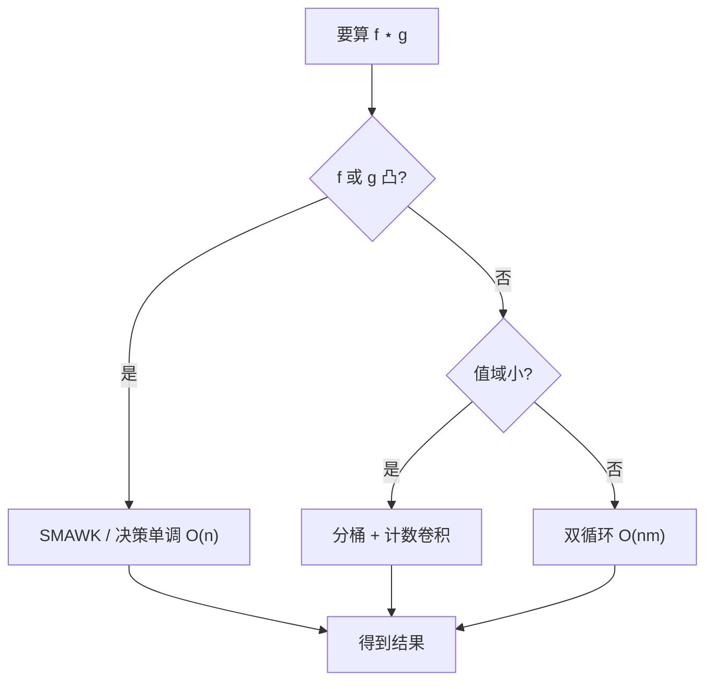
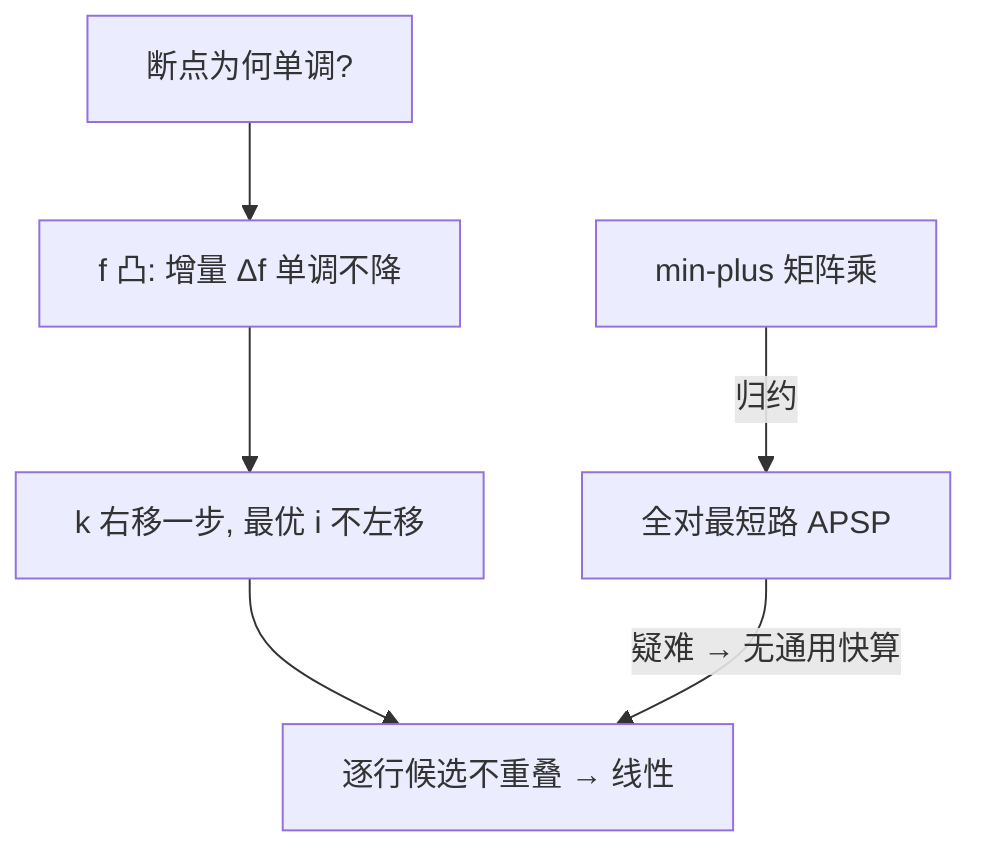

# min-plus-conv

把加法换成取 min、乘法换成加法，卷积就成了 DP 的合并动作——普通乘法有多快，决定了多少问题能成批解。

<footer>—— 据 Bellman《Dynamic Programming》(1957)；(min,+) 代数与 SMAWK (1987)</footer>

[拟阵理论](/cs/matroid-theory)划清了贪心的势力范围，本课换一块地基：**代数**。DP 转移「新值 = 上一段各处加代价后取最小」反复出现——背包合并、分段代价相加、字符串距离——它们全是同一个运算：$(f\star g)[k]=\min_i(f[i]+g[k-i])$，即 **min-plus 卷积**。认出它，才知道哪些情形能快、哪些注定慢。

## 问题

朴素计算 $f\star g$ 要 $O(n^2)$。普通卷积靠 FFT 提速到 $O(n\log n)$，但 FFT 依赖「乘法可分配、可逆」，min-plus 世界里这些都不成立。缺口：**min-plus 卷积何时存在次平方算法**。本课不碰一般情形的硬算——结论就是没有通用捷径，重点是认出可解特例。

术语翻译：(min,+) 代数（热带代数）= 把「加法」定义为 min、「乘法」定义为加法的半环；矩阵乘法照此定义搬过来，就是图上最短路的全源转移。

数字实例：$f=[0,2]$、$g=[1,0]$。$(f\star g)[0]=f[0]+g[0]=1$；$(f\star g)[1]=\min(f[0]+g[1],f[1]+g[0])=\min(0,3)=0$；$(f\star g)[2]=f[1]+g[1]=2$。结果 $[1,0,2]$，长度 $n+m-1$，与普通卷积同构。

## 方法

一般情形只有暴力双循环 $O(nm)$。可提速的两大特例：一是**凹/凸序列**——$f$ 或 $g$ 相邻差单调时，可证卷积结果也凸且最优断点单调，用 SMAWK 或分治决策单调把复杂度压到 $O(n)$ 或 $O(n\alpha(n))$；二是**值域小**——按值分桶后卷积可转成计数卷积再幂变换，视值域 $V$ 得 $O(V\log V)$ 类做法。

直觉类比：普通卷积像「两条河流在所有相位上叠加求和」；min-plus 卷积像「两个梯队会师，每个到达时刻只记最省的那条路线」。凸性相当于行军速度均匀——先到者恒先到，断点单调，不用回头比对。

## 机制

为什么凸性能救命：若 $f$ 凸，则 $f[i]+g[k-i]$ 关于 $i$ 的最优位置随 $k$ 增大**单调不降**（决策单调性），一维最小化可由 SMAWK 对全行并行求出，每行只碰 $O(n)$ 个候选。反过来，一般 min-plus 卷积与**全对最短路（APSP）等价**——把矩阵乘法定义成 (min,+) 乘即可互相归约，而 APSP 疑难意味着「通用次平方算法」在现有工具箱里不存在，这也是「认出特例」如此重要的底层原因。

常见误区：见到 min-plus 就套 FFT——「用指数打分再取 min」只在代价可分解为独立和时成立；硬变换会引入耦合项。另一个误区是以为凸性可后验补救：序列不凸时 SMAWK 的单调前提已塌，输出会错，不是变慢。

## 边界

工程判定三问：转移是不是真 min-plus（有无耦合项）？序列是否凸或近似凸？值域是否受限？三个都否定，就老老实实 $O(n^2)$ 并在常数上做文章。相邻关系：[Slope Trick](/cs/slope-trick) 是凸 min-plus 卷积在「在线增量」下的堆式化身；SMAWK 与决策单调分治是同一单调性的两种批量实现；图上的 (min,+) 矩阵幂对应定长最短路，与 Floyd–Warshall 同源。

直觉类比：热带代数像把世界调成「只关心最好的一条路，其余通通当无穷大」；普通代数里万物求和，热带代数里万物竞争——竞争世界的乘法就是会师时的加价。

## 小结

- DP 合并的数学身份是 min-plus 卷积；通用次平方算法不存在（与 APSP 等价）。
- 凸性给决策单调，SMAWK/分治把它压到线性；值域小走分桶。
- Slope Trick = 在线的凸 min-plus；先问凸不凸，再选工具。
- 出处：Bellman《Dynamic Programming》1957；Aggarwal–Park–SMAWK 1987；Chan–Williams APSP 归约 (2016)。
