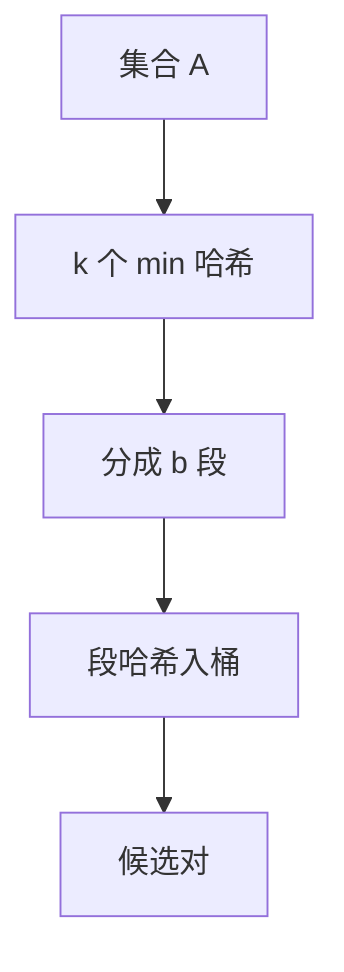

# MinHash 与 LSH

每个哈希取集合里最小的像；两集合签名相等的概率等于 Jaccard。多组签名做成桶，相似的对才进同一桶。

<footer>—— 据 Broder, On the Resemblance and Containment of Documents, SEQS 1997；Indyk and Motwani, Approximate Nearest Neighbors: Towards Removing the Curse of Dimensionality, STOC 1998 整理</footer>

[上一课](/cs/quotient-filter) 问成员。[Count-Min](/cs/count-min-sketch) 问频次。近重复文档、相似集合要 Jaccard $J(A,B)=|A\cap B|/|A\cup B|$，穷举对是平方。[通用散列](/cs/universal-hashing) 给独立排列的代理。本课不扫商簇。缺口是 MinHash 签名 + LSH 分桶。

## 问题

精确 Jaccard 要交并。MinHash：随机排列 $\pi$，签名 $\min\pi(A)$。$\Pr[\min\pi(A)=\min\pi(B)]=J(A,B)$。$k$ 个独立哈希得 $k$ 维签名，用相等比例估 $J$。LSH：把签名切成 $b$ 段，每段哈希进桶；至少一段完全相同则成候选，再精确比。缺口是**用碰撞概率对准相似度阈值**，避开高维 k-d 树失效。

Broder 1997 近似文档。Indyk–Motwani STOC 1998 提出 LSH 框架。本课不把 E2LSH 全部度量抄成词条。

## 方法

实现常用 $k$ 个哈希的最小，或一个哈希的 $k$ 个最小（bottom-$k$，分析略不同）。LSH 参数 $(b,r)$：$k=br$，使 $J$ 高的对期望进桶、$J$ 低的少进。候选再算真 Jaccard 或抽查。

与 HLL：HLL 是单集合基数；MinHash 是两集合相似。与 k-d：[k-d 树](/cs/kd-tree) 正交范围，LSH 对角度/Jaccard/欧氏有不同族。

## 机制

独立性不够则估计偏。对抗哈希同样破坏概率合同。不要把 LSH 写成深度学习检索课的唯一内容——本课是概率数据结构。

流上固定大小样本下一课蓄水池，问题从相似转到「均匀抽 $k$ 个」。

## 边界

本课不证明所有度量的 $(r,cr,p1,p2)$ 定义全文。欧氏 LSH 用 p-stable，点名。精确近邻在低维仍可用树。

后课默认：Jaccard 近似用 MinHash；分桶检索用 LSH。流上均匀样本用蓄水池。

## 小结

- MinHash：$\Pr(\text{签名相等})=Jaccard$。
- LSH：分段入桶放大近对碰撞。
- 下一课在未知长度的流上均匀抽样。
- 出处：Broder, 1997；Indyk and Motwani, *STOC*, 1998。
