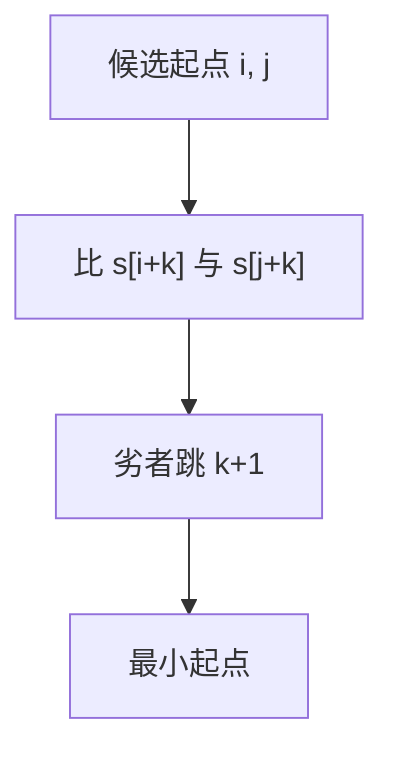

# 最小表示法

循环串的最小表示是所有旋转里字典序最小者；双指针在 $O(n)$ 内丢掉不可能更小的起点。

<footer>—— 据 Booth, Lexicographically Least Circular Strings, 1980；Duval 与 Lyndon 对照后课整理</footer>

上一课[Manacher](/cs/manacher)处理回文。循环同构：项链、循环码。缺口是最小表示：起点 $i$ 使 $s[i..]+s[0..i)$ 最小。不重写回文半径。后课后缀数组应用、再后 Lyndon。本课双指针即可。

## 问题

朴素比较所有旋转 $O(n^2)$。算法：指针 $i,j$ 为候选起点，$k$ 为已比长度。$s[i+k]\lt s[j+k]$ 则 $j$ 跳过一段，$j\leftarrow j+k+1$；反之 $i$ 跳。保证 $i\neq j$，均摊 $O(n)$。结果 $\min(i,j)$（还要处理越界取模）。

缺口是循环字典序，不是 Z 的线性 LCP（虽可用 $s+s$ 的后缀最小，后缀数组后课）。

### 不是排序全体旋转

不必生成 $n$ 个串。最小表示唯一（若要唯一再规定规则）。不要 $n$ 次 KMP。

Booth 1980。Lyndon 分解给出另一构造（后课 Duval）。后课 SA 可 $O(n)$ 或 $O(n\log n)$ 找最小后缀于 $s+s$。

## 方法

$i=0,j=1$。循环直到候选扫过 $n$。注意 $i+k$ 取模。输出从起点切断。

有相等环要防死循环，标准实现会把指针推过 $n$。

## 机制

更小字符出现时，对方起点及其后 $k$ 个位置都不可能最优。类似 KMP 的失配跳跃，对象是两个旋转。与 Lyndon：最小表示与 Lyndon 共轭相关，后课再收。

## 边界

本课不写带权旋转。不写二维循环。后课默认：循环最小表示线性双指针。下一课后缀数组的应用。

## 小结

- 循环字典序最小旋转，$O(n)$ 双指针。
- 不必枚举全部旋转。
- 与 Lyndon/SA 后课接口。
- 出处：Booth, 1980。
